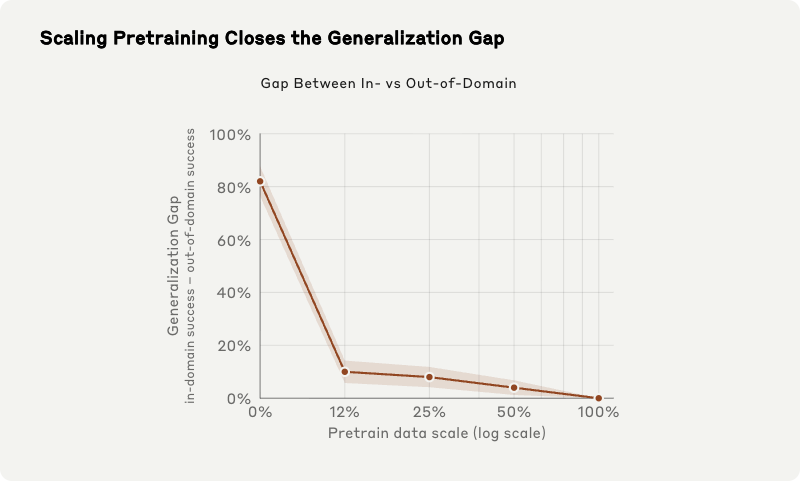
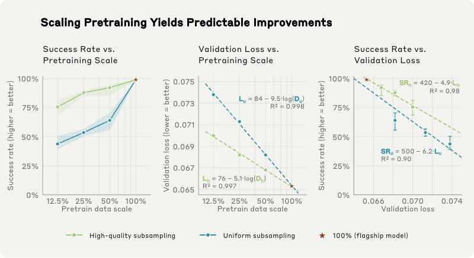
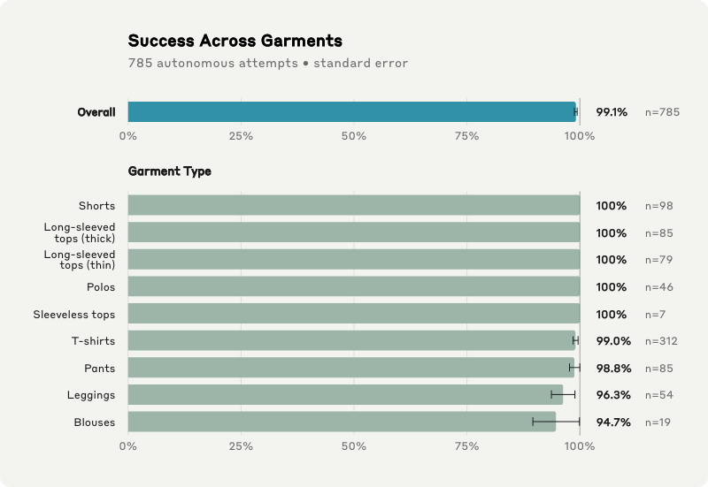
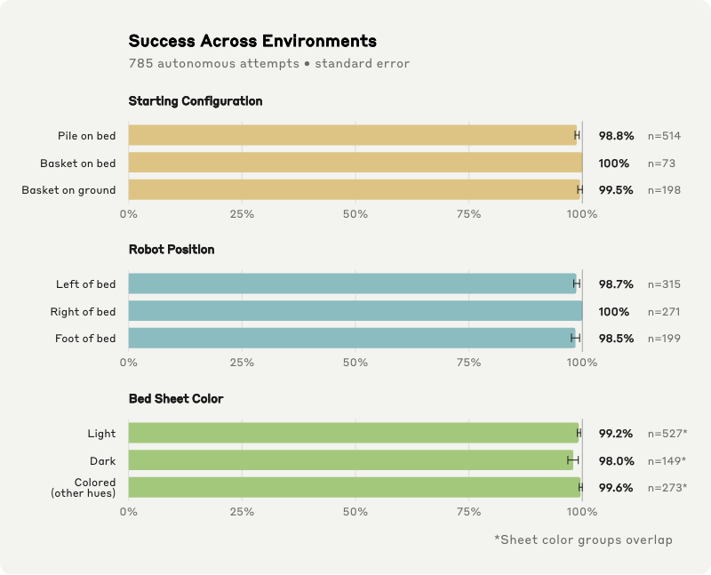
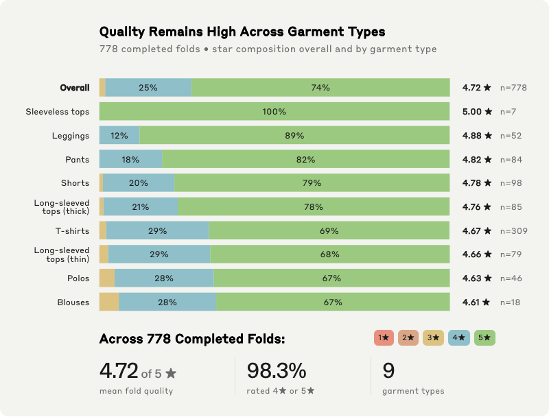
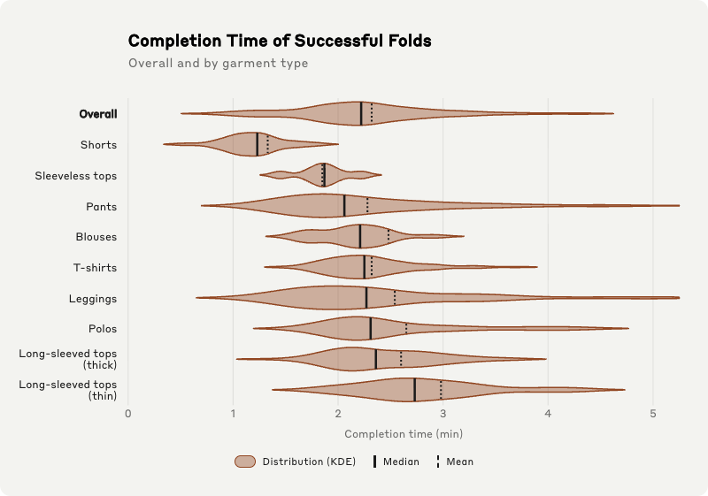

> 中文翻译与整理
> 原文：[ACT-2 Preview: Generalizing Reliability](https://www.sunday.ai/blog/act-2-preview)
> 作者：Sunday Robotics（Sunday Team）｜ 发布：2026 年 7 月 17 日 ｜ 篇幅：原文约 25 分钟阅读
>
> 引用格式：
> Sunday Robotics, "ACT-2 Preview: Generalizing Reliability", Sunday Robotics Blog, Jul 2026.
>
> 文中视频均外链原文站点（Mux 流）；图 1–图 8 为原文 JS 动态图表的截图，数据表为对应数值的整理。

---



1903 年，莱特兄弟的第一次飞行只持续了十二秒。它证明了动力飞行是可能的——而在此之后又过了几十年，飞行才变得安全、普及。机器人领域也正在产生属于自己的「首飞」：一个个 demo 让新能力变得可见，拓宽了整个领域的想象边界。但随着这些能力走向成熟，这个领域还必须去度量**可靠性**：当条件发生变化时，性能还能不能守得住。

ACT-2 建立在 **ACT-1** 之上。2025 年 11 月 ACT-1 被推出，在一套全栈系统内分别展示了长程移动操作、对未见过家庭的泛化，以及高级灵巧操作能力。${}^{[1]}$**ACT-2** 的核心进展在于：用一套自有的迭代闭环实现了性能「爬坡」，证明了**单个微调样例**就足以教会预训练模型一个新行为，而且这个行为是可泛化的。最终结果是：在多样化的、未见过的环境中折叠衣物，零样本（zero-shot）成功率达到 **99.1%**。

# 一、ACT-2：让可靠性泛化

ACT-2 的预训练数据是一份高质量、高多样性的**带传感器的人类数据集**，由 Sunday 自研的数据采集硬件、数据精选系统与数据处理流水线采集而来。

## 1.1 通过扩大预训练来关闭泛化鸿沟

后训练之后，域内成功率与域外成功率之差被称为**泛化鸿沟**。为了度量，我们可以在每一个预训练规模上施加**同一套**后训练流程，然后在 **in-domain 和 out-of-domain** 这两个分布上评测得到的模型。结果显示，泛化鸿沟随预训练规模**急剧下降**。这意味着在本地做性能爬坡，增益会在未见过的家庭里同样成立。

**图 1 · 折叠成功率的域内 vs 域外泛化鸿沟随预训练数据规模的变化**（阴影带为 ±1 标准误，每个成功率背后有 50 次评测）。

| 预训练数据规模 | 域内成功率 | 域外成功率 | 泛化鸿沟 |
|-|-|-|-|
| 0% | 96% | 14% | 82 |
| 12% | 100% | 90% | 10 |
| 25% | 100% | 92% | 8 |
| 50% | 100% | 96% | 4 |
| 100% | 100% | 100% | 0 |

但**光有规模还不够**。预训练数据的**质量与配比**同样决定了模型改进的效率。在数据量与算力都对齐的情况下，更高质量的数据带来更低的验证损失和更高的下游成功率。我们还发现**验证损失与成功率之间存在强相关**——这意味着：在跑昂贵的物理评测之前，就能先据此改进数据配比。

**图 2–4 · 更高质量的数据让预训练更高效**：成功率（±1 SE）与验证损失随预训练规模的变化，以及两者的相关性

| 数据配比 | 预训练规模 | 成功率 | ±1 SE | 验证损失 |
|-|-|-|-|-|
| **★ 旗舰模型** | 100% | **99.1%** | 98.8–99.4% | 0.0653 |
| 高质量子采样 | 12.5% | 75.6% | 68.5–81.2% | 0.0700 |
| 高质量子采样 | 25% | 87.9% | 85.3–89.9% | 0.0682 |
| 高质量子采样 | 50% | 92.3% | 85.4–94.6% | 0.0668 |
| 均匀子采样 | 12.5% | 43.8% | 39–50.4% | 0.0738 |
| 均匀子采样 | 25% | 53.6% | 50.5–56.7% | 0.0713 |
| 均匀子采样 | 50% | 64.1% | 55.7–70.5% | 0.0682 |

## 1.2 从单个样例学习可迁移的行为

> 📝 **脚注 2**：语言模型已经表明，扩大预训练可以大幅降低下游适配成本：GPT-1 仍然需要针对任务的微调，而 [GPT-3](https://arxiv.org/abs/2005.14165) 只靠一个 prompt 加几个样例就能完成许多任务。机器人领域正开始显现同样的模式：[π0](https://arxiv.org/abs/2410.24164) 表明广泛的预训练可以支撑通过微调快速习得新技能；而 [GEN-0](https://generalistai.com/blog/gen-0) 与 [GEN-1](https://generalistai.com/blog/gen-1) 报告，扩大物理预训练可以减少所需的任务专用机器人数据——在 GEN-1 所报告的任务上大约降到**一小时**。

我们用简单的**监督微调（SFT）**对同一个预训练模型的四份独立副本做了后训练。每份副本只收到**一条**演示，对应一种不同的折叠手法。随后把每个 checkpoint 都放到一件**在 SFT 中从未见过的留出衣物**上评测。四个模型**全部成功执行**了各自新学到的手法。



## 1.3 通过后训练爬坡可靠性

预训练赋予 ACT-2 在未见环境中泛化的能力，但**一次性的演示是不够的**。距离「可部署级别的可靠性与性能」剩下的那段差距，来自那些只有当策略在真实世界里被反复运行之后才会浮现的困难边缘情形与失败。而**让模型能从单条演示学会新行为的那种泛化能力，同样让它能高效地从「恢复行为（recoveries）」中学习**。我们的后训练闭环正是直接瞄准这些缺口。因为机器人、模型、基础设施与数据运营全都由我们端到端自己拥有，整个改进闭环可以跑得非常快。



# 二、家用机器人：通用智能的试金石

家用机器人有一个我们认为独一无二的性质：**研究–市场契合（research-market fit）**。让家用机器人变得有用的那些要求，恰好指向通用智能。我们用一个叫做 **Solve** 的标准来评测 ACT-2 在**折叠衣物**这项任务上的表现：**在一个明确声明的范围（scope）内、以一个明确声明的适配成本（adaptation cost）达成的可靠表现**。

## 2.1 ACT-2 的 Solve 边界声明

| 维度 | 声明内容 |
|-|-|
| **衣物范围** | 日常会被折叠、且折叠质量可以被一致评判的家庭物品——T 恤、长袖上衣（厚 / 薄）、Polo 衫、无袖上衣、衬衫（blouse）、长裤、打底裤（leggings）、短裤——覆盖不同尺码（XXS 到 8XL）、颜色、材质、厚度与纹理。**不含**袜子、内衣、配饰：它们的常规处理方式是配对、分类或悬挂，而不是折叠。 |
| **适配成本** | **每个家庭为零。**部署时不使用任何针对该家庭或该衣物的数据，目标家庭中没有专家演示，不做任何后训练。所有评测用例都使用**同一个模型 checkpoint 与同一套系统配置**。 |
| **场景** | 未见过的房间、各式各样的床与折叠台面、不同光照条件，从床的任一侧或床尾进行折叠。 |
| **初始构型** | 衣物起始于洗衣篮、衣物堆、床上或地上——任意朝向、自然褶皱状态。 |

**99.1% 的成功率是在上述声明分布上取得的，使用同一个模型 checkpoint，且每个家庭的适配成本为零。**



# 三、性能

**99.1% ± 0.3%** 总体成功率 ｜ **778** 次成功折叠 ｜ **9** 类衣物

所有折叠尝试都由一支标注团队使用专门搭建的评分工具打分。每次尝试被判定为成功或失败，成功的折叠再按下方质量评分表打分。评分分两轮进行：一名标注员给出初评，另一名独立复核，分歧由复核负责人裁定。标注员在正式评分前先在一组参考折叠样例上受训，评分表在评测开始前即已固定，事后未做修改。

## 3.1 长尾上的成功率

当且仅当衣物被**自主地**折叠并码放成堆时，一次尝试才会被算作成功。在覆盖 9 大类衣物的 **785 次自主尝试**中，ACT-2 的总体成功率为 **99.1%（±0.3% 标准误）**。

我们按衣物类型、初始构型、机器人站位、床单颜色分别做了分析，各类别的成功率都保持很高。

**图 5 · 按衣物类型的折叠成功率**（785 次自主尝试，误差为标准误）

| 类别 | 成功率 | ±1 SE | 尝试次数 |
|-|-|-|-|
| **总体** | **99.1%** | 98.8–99.4% | 785 |
| 短裤 | 100% | — | 98 |
| 长袖上衣（厚） | 100% | — | 85 |
| 长袖上衣（薄） | 100% | — | 79 |
| Polo 衫 | 100% | — | 46 |
| 无袖上衣 | 100% | — | 7 |
| T 恤 | 99.0% | 98.5–99.6% | 312 |
| 长裤 | 98.8% | 97.7–100% | 85 |
| 打底裤 | 96.3% | 93.7–98.9% | 54 |
| 衬衫（blouse） | 94.7% | 89.6–99.9% | 19 |

**图 6 · 按环境构型的折叠成功率**

<table><colgroup><col/><col/><col/><col/><col/></colgroup><thead><tr><th vertical-align="top">分组</th><th vertical-align="top">类别</th><th vertical-align="top">成功率</th><th vertical-align="top">±1 SE</th><th vertical-align="top">尝试次数</th></tr></thead><tbody><tr><td rowspan="3" vertical-align="top">初始构型</td><td vertical-align="top">床上的衣物堆</td><td vertical-align="top">98.8%</td><td vertical-align="top">98.4–99.3%</td><td vertical-align="top">514</td></tr><tr><td vertical-align="top">床上的洗衣篮</td><td vertical-align="top">100%</td><td vertical-align="top">—</td><td vertical-align="top">73</td></tr><tr><td vertical-align="top">地上的洗衣篮</td><td vertical-align="top">99.5%</td><td vertical-align="top">99–100%</td><td vertical-align="top">198</td></tr><tr><td rowspan="3" vertical-align="top">机器人站位</td><td vertical-align="top">床左侧</td><td vertical-align="top">98.7%</td><td vertical-align="top">98.1–99.4%</td><td vertical-align="top">315</td></tr><tr><td vertical-align="top">床右侧</td><td vertical-align="top">100%</td><td vertical-align="top">—</td><td vertical-align="top">271</td></tr><tr><td vertical-align="top">床尾</td><td vertical-align="top">98.5%</td><td vertical-align="top">97.6–99.4%</td><td vertical-align="top">199</td></tr><tr><td rowspan="3" vertical-align="top">床单颜色</td><td vertical-align="top">浅色 *</td><td vertical-align="top">99.2%</td><td vertical-align="top">98.9–99.6%</td><td vertical-align="top">527</td></tr><tr><td vertical-align="top">深色 *</td><td vertical-align="top">98.0%</td><td vertical-align="top">96.8–99.1%</td><td vertical-align="top">149</td></tr><tr><td vertical-align="top">彩色（其他色系）*</td><td vertical-align="top">99.6%</td><td vertical-align="top">99.3–100%</td><td vertical-align="top">273</td></tr></tbody></table>

*\* 床单颜色分组之间存在重叠。*

## 3.2 折叠质量

从**是否整齐、是否紧凑、是否完整、码放是否稳定**四个方面来评判折叠质量。每次折叠从五星起评，出现下列任一类缺陷各扣一星：${}^{[5]}$

| 缺陷类别 | 扣分 | 判定标准 |
|-|-|-|
| 折叠过度（Overfold） | −1★ | 向内折入的多余布料超过 2 英寸 |
| 错位（Misalignment） | −1★ | 相互对应的边缘偏差超过 2 英寸 |
| 未折进的部件 | −1★ | 袖子、裤腿或帽子伸出折叠体超过 2 英寸 |
| 码放错误 | −1★ | 超出衣堆宽度 1/3 以上，或码放时把折痕弄乱 |

> 📝 **脚注 5**：之所以取 2 英寸作为阈值，是因为超过这个量的多余或错位布料会在折叠件上形成明显鼓包，使衣物更难被整齐码放。

在 **778 次完成的折叠**中，ACT-2 的平均得分为 **4.72 / 5**：**98.3%** 达到四星或五星的质量线，其中 **73.8%** 拿到满分。在评测分布中样本较充分的衣物类型里，平均质量从 Polo 衫的 4.63 到打底裤的 4.88 不等。

**图 7 · 折叠质量的星级构成**（778 次完成的折叠）

| 衣物 | 3★ | 4★ | 5★ | 均分 | n |
|-|-|-|-|-|-|
| **总体** | 1.67% | 24.6% | 73.8% | **4.72** | 778 |
| 无袖上衣 | 0% | 0% | 100% | 5.00 | 7 |
| 打底裤 | 0% | 11.5% | 88.5% | 4.88 | 52 |
| 长裤 | 0% | 17.9% | 82.1% | 4.82 | 84 |
| 短裤 | 1.02% | 20.4% | 78.6% | 4.78 | 98 |
| 长袖上衣（厚） | 1.18% | 21.2% | 77.6% | 4.76 | 85 |
| T 恤 | 1.94% | 29.4% | 68.6% | 4.67 | 309 |
| 长袖上衣（薄） | 2.53% | 29.1% | 68.4% | 4.66 | 79 |
| Polo 衫 | 4.35% | 28.3% | 67.4% | 4.63 | 46 |
| 衬衫（blouse） | 5.56% | 27.8% | 66.7% | 4.61 | 18 |



## 3.3 速度

完成时间：从 ACT-2 开始取出一件衣物，到它把折好的衣物放上衣堆为止，**包含自主重试与恢复动作**。

在 778 次成功尝试中，ACT-2 的完成时间中位数为 **2 分 13 秒**，均值为 **2 分 19 秒**。完成时间因衣物类型而异，反映了几何形状与操作复杂度的差别。

**图 8 · 成功折叠的完成时间（单位：分钟）**

| 衣物 | 中位数 | 均值 | 10% | Q1 | Q3 | 90% | n |
|-|-|-|-|-|-|-|-|
| **总体** | **2.22** | **2.32** | 1.36 | 1.86 | 2.64 | 3.24 | 778 |
| 短裤 | 1.23 | 1.33 | 0.88 | 1.03 | 1.39 | 1.79 | 98 |
| 无袖上衣 | 1.87 | 1.85 | 1.61 | 1.76 | 1.95 | 2.09 | 7 |
| 长裤 | 2.06 | 2.28 | 1.45 | 1.72 | 2.67 | 3.46 | 84 |
| 衬衫（blouse） | 2.21 | 2.48 | 1.74 | 2.03 | 2.41 | 3.34 | 18 |
| T 恤 | 2.25 | 2.32 | 1.83 | 2.01 | 2.51 | 2.90 | 309 |
| 打底裤 | 2.27 | 2.54 | 1.55 | 1.81 | 2.82 | 3.65 | 52 |
| Polo 衫 | 2.31 | 2.65 | 1.97 | 2.11 | 2.93 | 3.98 | 46 |
| 长袖上衣（厚） | 2.36 | 2.60 | 1.90 | 2.12 | 2.83 | 3.27 | 85 |
| 长袖上衣（薄） | 2.73 | 2.98 | 2.10 | 2.43 | 3.24 | 4.00 | 79 |

## 3.4 涌现行为

ACT-2 最令人印象深刻的一点，是它**频繁地出乎我们意料**。大规模预训练产生了一些并未被显式教授、却在长尾条件下涌现出来的行为：边缘情形的恢复、受扰动下的鲁棒性，以及让 Memo 把作业范围扩展到超出桌面机器人工作空间的**全身操作**。



















# 四、Solve：一个衡量机器人进展的新标准

**Solve**：**在一个声明的范围内、以一个声明的适配成本达成的可靠表现。**

每个 Solve 包含三个组成部分：

| 组成部分 | 含义 |
|-|-|
| **Performance 性能** | 在声明边界内该能力工作得多好，包括成功率、质量、速度 |
| **Scope 范围** | 该性能被主张成立的环境、物体与构型的分布 |
| **Adaptation cost 适配成本** | 每一次新部署所需的额外数据、演示、微调、人工干预或系统改造 |

三者合在一起，才能让机器人领域的进展变得**可比较、可累积**。只有当范围和适配成本被明确指定之后，成功率、质量、速度这些指标才有意义。也只有到那时，我们才能真正衡量：一个策略**有用的作业范围**是否在扩大、**部署要求**是否在下降、以及边界内的**性能**是否在提升。

# 五、走向通用机器人

这份 ACT-2 预览把**洗衣折叠**作为我们的第一个 Solve，但同一个基座模型已经在学习更广泛的一批家务能力，包括**吸尘、玩具收纳、拉拉链、把裤子翻回正面、冲咖啡**。这些能力尚未按 Solve 标准进行测试，但每一项都在锤炼共享模型的不同侧面：工具使用、整理杂乱空间、精细操作、长程可靠性。











> 💡 各项能力的进展**可以是不均衡的**。通用智能并不要求每一种行为都以相同速率提升。一个每项任务都只有 60% 可靠度的机器人，可能还不如一个把少数几件有价值的事做得非常可靠的机器人有用。把**一项有价值的能力推过部署阈值**，既能立刻造出一个有用的系统，也能为模型改进启动飞轮。

# 六、把 ACT-2 带进家庭

1914 年，距那十二秒的首飞已过去十一年，第一家航空公司在坦帕湾开通了一条定期航线，每天两班。这一转变之所以重要，是因为它意味着飞行已经**可靠到足以支撑常态化使用**；而一旦到了这一步，航空业便从一条航线扩展成了全球网络。

正如航空从「证明可能」走向「可靠服务」，ACT-2 也让 Sunday 从「展示 Memo 能做什么」走向「**让它的可靠性在真实世界变化中泛化**」。从这里开始，机器人进入一个加速阶段：**智能开始复利**——每一次改进都会传播到整个机队，每一项新能力都让下一项更容易学会。

今年秋天，我们将通过 **Beta 计划**把 Memo 部署到家庭中。这是迈向那样一个近未来的一步：通用机器人成为日常生活中值得信赖的一部分——在不同家庭中都有用、能适应意外情况，并快速扩展人们可以依赖的能力集合。
