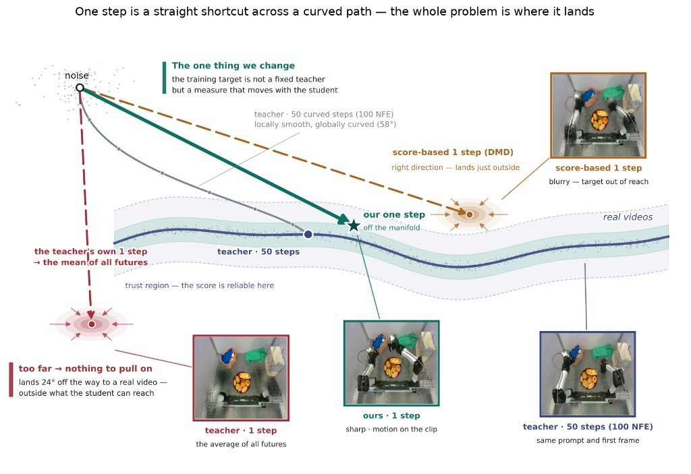

> 技术报告（中文翻译与整理）
> 原文：[Dyna-2: A 1-Million-Hour Scaling Law for World-Action Models](https://www.dyna.co/dyna-2)
> 作者：Dyna Robotics ｜ 发布：2026 年 8 月 ｜ 篇幅：原文约 31 分钟阅读
>
> 引用格式：
> ```bibtex
> @article{dyna2026dyna2,
>   author = {{Dyna Robotics}},
>   title  = {Dyna-2: A 1-Million-Hour Scaling Law for World-Action Models},
>   year   = {2026},
>   month  = {August},
>   url    = {https://dyna.co/dyna-2},
> }
> ```

---

## 摘要

一个在 **1,000,000 小时以上**人类视频上预训练的世界-动作模型（world-action model, WAM），在人类数据与机器人数据两侧的评测上都表现出成立的 scaling law——以及支撑这一结果的大量技术洞察。

<video src="./assets/videos/dyna2-hero-mobile.mp4" poster="./assets/images/dyna2-hero-poster.jpg" controls loop muted playsinline preload="none" width="100%"></video>

**图 1. Dyna-2 是一个在超过一百万小时人类视频数据上预训练的世界-动作模型（WAM）。** 它在留出（held-out）人类数据上展现出 scaling law，并且首次证明了「人类→机器人」迁移 scaling law 的存在。这段拼贴里的每一个片段都是 Dyna-2 自己生成的。

<video src="./assets/videos/dyna2-mosaic-ego-mobile.mp4" controls loop muted playsinline preload="none" width="100%"></video>

*同上：第一人称片段拼贴，全部由 Dyna-2 生成。*

### 本文的两条 scaling law

| 评测侧 | 指标 | 1k hr | 10k hr | 100k hr | 1M hr | 幂律拟合 | R² |
|---|---|---|---|---|---|---|---|
| 留出人类数据 | MSE ↓ | 0.062 | 0.057 | 0.056 | 0.054 | $\mathrm{MSE}=0.0691\cdot D^{-0.0184}$ | 0.919 |
| 留出人类数据 | acc@0.5 ↑ | 0.40 | 0.44 | 0.45 | 0.47 | $\mathrm{acc}@0.5=0.357\cdot D^{+0.0203}$ | 0.865 |
| 零样本机器人数据 | MSE ↓ | 0.180 | 0.174 | 0.124 | 0.117 | $\mathrm{MSE}=0.306\cdot D^{-0.0713}$ | 0.884 |
| 零样本机器人数据 | acc@0.5 ↑ | 0.067 | 0.074 | 0.136 | 0.159 | $\mathrm{acc}@0.5=0.0241\cdot D^{+0.139}$ | 0.918 |

**图 2. 本文要讲的两条 scaling law。** 两行报告的是同样的两个指标——平方误差与 accuracy@0.5——因此人类侧与机器人侧的坐标轴可直接比较。**上半：** 更多第一人称人类经验会让动作预测在留出人类数据上更好，且看不到平台期（另外两个指标 L1 与 accuracy@0.1 见 §3）。**下半：** 同样的人类小时数——训练中**零机器人数据**——单调地改善了在**两种本体、39 个机器人任务**上的预测（分域曲线与本体差异分析见 §3）。虚线是幂律拟合 $y = a \cdot D^{-b}$，$D$ 以小时为单位。在机器人那一行，约 1M 小时的那个预训练分支其数据源混比与嵌套阶梯（nested ladder）不同（原图中以菱形标出）。

---

## § 1 引言

对通用机器人的热情从未如此高涨，而扩大机器人基础模型的规模一直是通往它最有希望的路径。然而这个领域对最基本的问题——如何扩展数据与模型——尚无共识。这些问题或许可以按顺序这样提出：

1. 机器人学习的预训练数据，正确的来源是什么？
2. 扩展该数据源，是否会在机器人性能上产生 scaling law？
3. 要让这条 scaling law 成立，需要哪些建模与目标函数上的选择？

这个领域已经探索过若干预训练数据来源，最主要的是**遥操作**与**专用采集设备**。两者都能产出有价值的、带动作标签的数据，我们自己也在采集并训练。但这类数据的每一小时都必须被刻意生产出来，这就限定了它单独能把预训练推进多远。从第一性原理出发，我们相信答案来自目标本身：一台通用机器人最终应当能够完成**任何当前由人类完成的、具有经济价值的任务**。因此，预训练数据的正确来源，理应是**人类执行这些任务时的传感化记录**（例如视频）——它已经以近乎无界的规模存在，并且恰好携带了一个操作策略需要学习的东西：场景如何演化、物体在接触下如何响应、以及一只手如何与它们交互。

诚然，向人类学习在今天存在本体差异（embodiment gap）。但我们相信，只要**任何一条**迁移 scaling law 能被建立（即：人类数据上的 scaling law 蕴含机器人数据上的 scaling law），那么从此往后的技术路径就可以被相对明确地定义：**采集更多传感化的人类数据，同时让我们的机器人在形态上更接近人类。**

今天我们发布 **Dyna-2**，我们新的旗舰世界-动作模型（WAM<sup>[4]</sup>），在超过一百万小时的第一人称人类视频上预训练——大致相当于**170 年**不间断的清醒经验。Dyna-2 建立了若干新颖且令人意外的 scaling law，直接回应了上面提出的问题。具体而言我们发现：

- 世界-动作模型的 scaling law **在直到一百万小时的人类数据范围内成立**；
- **首次**存在一条**「人类→机器人」迁移 scaling law**；也就是说，预训练中更多的人类数据，会改善模型在**从未见过的**机器人数据上的离线预测；
- **数据与目标函数都重要**；世界建模以及在视频数据上做扩展，是跨本体 scaling 迁移得以涌现的**必要条件**。

此外，超出上述重点 scaling law 结果，我们发现 scaling law 的趋势会**传导到后训练（post-training）后的真机性能**上。仅用几小时纯机器人数据做后训练、且预训练阶段完全没有见过机器人数据，后训练的 Dyna-2 模型就能在双臂平行夹爪、以及半人形与灵巧手平台上完成任务，且相对性能与离线机器人 scaling law 一致。一个极端的例子是：**仅 13 分钟**的遥操作数据，就足以把 Dyna-2 微调到用两只五指机器手完成**开瓶盖**。

除 scaling law 相关结果外，我们还展示了 Dyna-2 的若干新能力，包括增强的**鲁棒性**、**精度**、**指令跟随**、**零样本达到生产级表现**，以及**一步视频生成**。总体而言，Dyna-2 相比我们此前的模型是一次显著提升；同时它给出了一些有力的经验证据，有助于回答该领域的一些开放问题，可以作为未来研究的一个有力参照。

---

## § 2 模型架构与训练目标

Dyna-2 是一个**世界-动作模型**<sup>[4]</sup>：一个单一的生成模型，能够**联合或分别**地对未来视频与未来动作做去噪，构建在一个**视频扩散（video diffusion）骨干**之上。

在架构上它是一个**混合 Transformer（mixture of transformers）**<sup>[2,3,28]</sup>：每一种输入模态（包括视频和动作）被单独 token 化，并拥有一套**各自独立的 DiT 层**<sup>[27]</sup>，它们之间可以通过注意力操作相互 attend；而本体感知（proprioception）被 token 化后直接作为输入喂给动作 Transformer。

- **视频 token** 使用**因果掩码（causal masking）**；
- **动作 token** 使用**双向自注意力**（无因果掩码），并 attend 到已观测上下文的视频 token——至于它们**是否也 attend 到被预测的未来视频**，恰恰就是下文要研究的目标函数选择；
- **视频 token 交叉注意到文本 token**；**文本不直接影响动作 token**。

```
                     Instruction
                         │
                   [Text encoder]
                         │ cross-attn
                         ▼
  Context frames ──► Context video tokens ──┐
  Noised future        (causal mask)        │
  video z_t   ──►  ...                      │
                                            ├──► Predicted future video
                                            │      （仅 L_joint 时参与）
  Proprio     ──┐                           │
  Noised action ├──► Action tokens ◄─────────┘
  chunk a_t   ──┘   (双向自注意力，浅层)          └──► Action chunk
```

**图 3. Dyna-2 架构示意。**（原文为交互式图示，此处按其文字描述重绘。）

在早期的架构探查中，我们发现 **DiT 式视频扩散架构的时序推理能力大部分保留在浅层**<sup>[1]</sup>。因此我们有意把**动作 Transformer 设计得更浅**，并且**只在浅层与视频流汇合**。我们发现这样做在**不牺牲性能**的前提下**大幅改善了模型的实时推理延迟**。

### 训练目标：流匹配

Dyna-2 采用**流匹配（flow matching）**<sup>[18,19]</sup> 训练。设 $c$ 为条件上下文（过去帧、本体感知与语言指令），$z$ 为未来视频的隐变量，$a$ 为未来动作块（action chunk）。按标准流匹配设定，模型沿一条指向噪声的直线路径腐蚀各模态的真实样本：

$$
z_t = tz + (1-t)\varepsilon_z, \quad a_t = ta + (1-t)\varepsilon_a, \quad \varepsilon_z, \varepsilon_a \sim \mathcal{N}(0, I)
$$

并训练一个网络 $u_\theta$ 去预测能对被腐蚀样本去噪的**速度场（velocity）**。

对于我们用来研究 scaling law 的那一版 Dyna-2 模型，模型在**视频预测与动作预测上共同训练（co-train）**。也就是说，视频损失与动作损失**共享主干**，但被拟合为**两个独立的边缘速度场**：

$$
\mathcal{L}_{\mathrm{co}}(\theta) = \mathbb{E}\left\lVert u_\theta^{\mathrm{vid}}(z_t; t, c) - (z - \varepsilon_z)\right\rVert^2 + \lambda\,\mathbb{E}\left\lVert u_\theta^{\mathrm{act}}(a_t; t, c) - (a - \varepsilon_a)\right\rVert^2
$$

由于 $u_\theta^{\mathrm{act}}$ **从不把 $z_t$ 作为参数**，视频损失可以塑造共享表征，但在**推理时模型保持反应式（reactive）**——即策略在推理时既不生成、也不 attend 被预测的未来视频。

---

## § 3 操作 scaling law：从 1,000 到 1,000,000 小时

我们希望回答以下问题：

1. 在一百万小时人类数据上训练的世界-动作模型，是否存在 scaling law？
2. 是否存在「人类→机器人」迁移 scaling law？也就是说，更多人类经验是否会改善模型在**预训练期间从未见过**的机器人数据上的离线预测？
3. 跨本体 scaling law 是否能转化为**微调后的真机性能**？
4. 跨本体 scaling law 的涌现，取决于什么？

我们先描述人类预训练数据以及用于评测 scaling law 的指标，然后依次回答这四个问题。

### 预训练数据：嵌套且小时数精确的人类经验子集

我们已构建了一个总计**超过一百万小时**的人类操作视频语料库。其中大部分是**头戴式第一人称**记录，内容为人们执行日常操作——做饭、收拾、折叠、装配——由我们的数据合作方以及我们自己的内部作业采集。

我们搭建了一套完整的**数据清洗、手部姿态提取、校验与过滤**流水线，以确保跨多个数据源的有效性与一致性。对于通过手部姿态质量门槛的片段，其标注包含 **3D 手部姿态轨迹**，我们从中导出动作流所训练的**伪动作监督（pseudo-action supervision）**：

- **腕部位姿**作为末端执行器轨迹；
- 由**拇指—食指开合度（thumb–index aperture）**导出的**连续抓握信号**。

我们**没有**做任何视觉上或本体特定的数据处理来缩小预训练数据与下游机器人数据之间的视觉或运动学差异；我们的兴趣是研究**仅由 scaling 带来的**模型性质。因此，我们相信我们的发现是通用的，也应当能迁移到本工作未研究的其他本体上。

<video src="./assets/videos/dyna2-fig4-samples.mp4" controls loop muted playsinline preload="none" width="100%"></video>

**图 4. 预训练数据示例。** 从语料库中随机抽取的 36 段第一人称片段，同时播放：厨房、工坊与居住空间中的日常双手操作，两只手都在画面内。

从这个语料库中，我们构造出**恰好 1,000、10,000、100,000、1,000,000 小时**的**嵌套子集**，且**保持来自每个数据源的比例一致**。这样，更大的预算永远只是**追加**数据、而不**替换**数据，于是 scaling law 曲线上各点之间的差异**不可能**用子集之间的分布漂移来解释。

另有一个与所有训练子集**互不相交的 100 小时验证集**，在所有人类数据评测中固定不变；所有人类数据上的留出数字都在它上面计算。所有点上的训练与评测配置完全相同，因此唯一的变量就是**经验小时数**。计算量与模型规模的 scaling 实验留待未来工作。

### 评测指标

scaling 的结论可能是所用指标的产物：非线性或不连续的指标会无意中让平滑改善的模型看起来像是"涌现"<sup>[7]</sup>。为确保我们的 scaling law 对指标选择不敏感，我们在**两个连续误差**和**两个离散阈值化准确率**上都做报告。

对预测动作块 $\hat{a}$ 与真值 $a$，我们计算在动作维度与块时域上平均的 **MSE** 与 **L1** 误差，以及 **accuracy@$\tau$**——即落在真值 $\tau$ 之内的动作维度比例（以归一化动作单位计），在 $\tau = 0.5, 0.1$ 两处报告。

在我们的内部研究中，我们发现 $\tau = 0.5$ 是**总体运动意图**的良好度量，适合研究「人类→机器人」迁移 scaling law；而更紧的阈值如 0.1 是**动作精度**的良好指示，能反映域内（即人类→人类）的 scaling 趋势。

### Q1：百万小时人类数据上训练的世界-动作模型存在 scaling law 吗？

为研究这个问题，我们在上述从 1,000 到 1,000,000 小时的数据规模阶梯上训练 Dyna-2 模型，并在留出的人类数据集上评测。为消除 checkpoint 偏差，我们在一个**靠后的训练步窗口内评测 10 个 checkpoint**，报告每个指标的**均值与标准差**。

| 指标 | 1k hr | 10k hr | 100k hr | 1M hr | 幂律拟合 | R² |
|---|---|---|---|---|---|---|
| 留出 MSE ↓ | 0.062 | 0.057 | 0.056 | 0.054 | $0.0691\cdot D^{-0.0184}$ | 0.919 |
| 留出 L1 ↓ | 0.140 | 0.131 | 0.129 | 0.127 | $0.151\cdot D^{-0.0132}$ | 0.879 |
| accuracy@0.1 ↑ | 0.017 | 0.021 | 0.024 | 0.026 | $0.0116\cdot D^{+0.0606}$ | 0.926 |
| accuracy@0.5 ↑ | 0.40 | 0.44 | 0.45 | 0.47 | $0.357\cdot D^{+0.0203}$ | 0.865 |

**图 5. Dyna-2 直到百万小时人类数据的 scaling law。** 四个指标全部单调扩展，且**阈值化指标改善最快**——在整条阶梯上 accuracy@0.1 上升 **51%**，而 MSE 只改善 **12%**。

如上所示，在**每一个**指标上，留出预测都**单调改善**，且每一个都能被一条**以小时数为自变量的幂律**很好地描述。这是一个非常重要的结果：它是**首个在真实世界操作数据上验证到 100 万小时量级的 scaling law**；同时它也验证了我们的 Dyna-2 架构是稳健的，能够吸收数百万小时数据并在百万小时量级上持续改进。综合起来，这些结果确认了：**在同一本体（即人类）上度量时，物理交互的准确性可以通过把数据集扩展到百万小时量级而被可预测地改善。**

### Q2：人类数据上的 scaling law 是否蕴含机器人数据上的 scaling law？

上面的结果以前所未有的规模度量了对留出**人类**数据的泛化。但对机器人学而言，人类数据上的 scaling law 只有当这种 scaling 也能**在机器人数据上涌现并被度量**时才最有意义。

据我们所知，此前没有工作展示过**跨本体迁移 scaling law**——即在**预训练集中被完全留出的本体**的数据上度量评测指标，**且不做任何额外适配或微调**<sup>[6,29,30]</sup>。在我们的研究中，我们要做的是**仅在人类数据上预训练，直接在留出的机器人数据上评测**。

具体来说，我们在一个精心挑选的留出机器人数据集上评测了同一组按规模阶梯排列的 Dyna-2 checkpoint。这个机器人评测数据集包含**两种不同的固定式双臂 YAM 平台上的 39 个任务**：

- **12 个**任务来自我们内部的固定式 YAM 双臂 benchmark；
- **27 个**任务来自 **xdof ABC**<sup>[31]</sup>。

两个来源合计 39 个任务，覆盖广泛的日常操作分布，例如布料处理、打结、装箱、清洁、餐饮服务与装配。我们**有意纳入外部 YAM 数据集**，以确保评测不会偏向我们自己设计的任务。本节中**没有任何 checkpoint 在这两个来源的任何一条轨迹上训练过**。

<video src="./assets/videos/dyna2-fig6-robot-gallery-mobile.mp4" controls loop muted playsinline preload="none" width="100%"></video>

**图 6. 离线机器人评测任务的代表性画廊。**

零样本离线机器人评测结果如下。令人意外的是，**所有指标都随预训练人类数据的规模单调排序**。

| 指标（零样本机器人） | 1k hr | 10k hr | 100k hr | 1M hr |
|---|---|---|---|---|
| 动作 MSE ↓（全部 39 任务） | 0.180 | 0.174 | 0.124 | 0.117 |
| accuracy@0.5 ↑（全部 39 任务） | 0.067 | 0.074 | 0.136 | 0.159 |

*原图另有 dyna（12 任务）与 xdof（27 任务）的分域曲线，两者趋势与合计一致。*

**图 7. Dyna-2 首次展示了一条「人类→机器人」迁移 scaling law。** 在模型于预训练期间从未见过的机器人数据上评测，性能随人类数据的扩展**可预测地**改善。

**据我们所知，这是首次跨越本体差异被展示出来的 scaling law**：留出机器人验证指标随着**纯人类数据**的增长而单调下降。我们在经验上观察到一个从 **10k 到 100k 小时**的**拐点（inflection point）**，这提示：在覆盖度足够时，**跨本体知识迁移可能仅凭规模本身就会涌现**。

> **关键结论 —— SCALING LAW 从人类迁移到机器人**
>
> 世界-动作模型的 scaling law 可以从人类数据中导出。**仅扩展人类数据**就能改善世界-动作模型对机器人的预测。

### Q3：跨本体 scaling law 能否转化为微调后的真机性能？

最后，我们验证跨本体迁移 scaling law 是否延伸到真机性能。为此，我们从 scaling 阶梯的 4 个梯级中各取**步数对等的 checkpoint**，在**同一套内部 benchmark 任务数据集（14 个任务）**上做后训练；每个任务**最多 10 小时**机器人数据。

我们用**完全相同的协议**、以**盲测**方式（评测者不参与模型开发）对每个任务评测模型 **10 次试验**（语言跟随任务 12 次）。简而言之，后训练模型之间**唯一的变量**就是：在纯人类预训练中用了多少小时的人类视频。

注意，与此前的「人类→机器人」迁移结果<sup>[6,17]</sup> 不同，我们**有意不做**人类-机器人对齐或 co-training<sup>[17,36]</sup>。我们相信那样做很可能带来更好的后训练性能，但本研究的兴趣在于**归因于预训练 scaling 的改善**。

这 14 个任务跨越若干操作能力：

- **精准抓放**：Pick & Place、Unsort、Trash Tray Pickup、First Aid Kitting
- **可变形物体操作**：Rope Tie、Pants Hanger Preparation
- **精度**：Food Scooping、Fridge Tube Insertion、Lockbox Key Turning
- **铰接物体交互**：Tote Construction、Mug Unboxing
- **灵巧多指操作**：Highlighter in Drawer、Bottle Cap Untwisting
- **语言跟随**：Targeted Drink Retrieval（策略需遵循一条指定要从冰箱取哪种饮料的键入指令）

它们运行在**三种机器人本体**上：

- **11 个**任务使用配备 6-DOF **YAM** 手臂与自研平行夹爪的固定式双臂平台；
- **2 个**任务使用同样的手臂，但装配一对 **WUJI-2 20-DOF 灵巧多指手**；
- **语言跟随**任务运行在我们**半人形机器人的早期原型**上。

任务多样性带来了不同的原生指标，因此我们**按各任务的原生指标分别报告**；为了把它们放到同一坐标轴上，我们把每一个归一化为**该任务可达最大值的比例**（100% 成功率、Pick & Place 上全部 10 个物体、或 Trash Tray Pickup 上全部 6 件）；这些比例在 14 个任务上的**均值**就是我们用来绘制 scaling 图的**单一归一化分数**——其中 50% 表示平均达到了各任务上限的一半。

#### 总体：预训练规模贯穿后训练传导到真机

| 全部 14 任务，平均归一化分数 ↑ | 1k hr | 10k hr | 100k hr | 1M hr |
|---|---|---|---|---|
| 均值 | **20%** | **28%** | **45%** | **53%** |

#### 逐任务，原生指标

| 任务 | 类别 | 原生指标 | 1k hr | 10k hr | 100k hr | 1M hr |
|---|---|---|---|---|---|---|
| Highlighter in Drawer | 灵巧 | 成功率 ↑ | 10% | 80% | 80% | **90%** |
| Bottle Cap Untwisting | 灵巧 | 成功率 ↑ | 10% | 10% | 40% | **50%** |
| Trash Tray Pickup | | 平均拾取件数（共 6）↑ | 2.2 | 3.9 | 4.5 | **4.8** |
| Pants Hanger Preparation | | 成功率 ↑ | 10% | 0% | 20% | **50%** |
| Rope Tie | | 打结成功率 ↑ | 0% | 40% | **90%** | 40% |
| Lockbox Key Turning | | 成功率 ↑ | 0% | 0% | 0% | **90%** |
| Food Scooping | | 成功率 ↑ | 10% | 30% | **80%** | 50% |
| First Aid Kitting | | 平均正确分格物体数（共 10）↑ | 2.0 | 0.2 | 2.9 | **4.8** |
| Unsort | | 平均移出箱外物体数（共 10）↑ | **6.4** | 5.5 | 3.6 | 5.8 |
| Fridge Tube Insertion | | 成功率 ↑ | 10% | 10% | 10% | **20%** |
| Tote Construction | | 成功率 ↑ | 20% | 10% | **40%** | 30% |
| Mug Unboxing | | 成功率 ↑ | **20%** | 0% | 10% | **20%** |
| Pick & Place | | 平均放置物体数（共 10）↑ | 1.8 | 2.1 | **4.2** | 3.9 |
| Targeted Drink Retrieval | 语言 | 成功率 ↑ | 58% | 75% | **83%** | **83%** |

**图 8. 预训练规模贯穿后训练传导到机器人，并且一直攀升到最大的那一级。**

在 14 个任务上聚合后，**平均归一化性能随预训练规模单调上升：20% → 28% → 45% → 53%** 的可达最大值。在一百万小时处，后训练模型给出了**总体最强的真实世界性能**，并在 **14 个任务中的 9 个**上最优。

若干任务看起来需要**一个阈值量级的预训练**才变得可解。**Lockbox Key Turning** 是最清楚的例子：**直到 100,000 小时都没有任何 checkpoint 能把钥匙转动**；而在一百万小时处，钥匙被成功转动的比例达到 **90%**。

数据效率在另一个极端同样惊人：**Bottle Cap Untwisting 仅用约 10 分钟**的机器人演示做后训练，却依然随着预训练规模从较小预算下的 10% 攀升到 **40% 和 50%**。这一趋势也延伸到语言跟随：**Targeted Drink Retrieval 从 58% 上升到 83%**。

在全过程中，后训练配方对每个任务都**完全一致**：**只用机器人数据，不做 co-training，不做人类-机器人对齐**。在这个配方之内，预训练 scaling law 跨任务、跨本体、跨能力地传导到了物理机器人上。

<video src="./assets/videos/dyna2-fig9-rollouts-mobile.mp4" controls loop muted playsinline preload="none" width="100%"></video>

**图 9. 后训练策略的自主 rollout 示例**（顶部相机，1× 速度）。每个策略都在人类第一人称视频上预训练，并**仅**在对应任务的几小时机器人演示上后训练。

### Q4：跨本体 scaling law 的涌现取决于什么？

Dyna-2 是一个既学习预测未来世界状态、也学习预测机器人动作的世界-动作模型，但这个建模选择真的重要吗？

通过受控实验，我们在经验上证明：**预测视频**这件事 (1) **使跨本体迁移能够通过 scaling 实现**，并且 (2) **视频是具身 AI 的一条新 scaling 轴**——扩大预训练中**纯视频**数据的量，也会可预测地改善留出机器人数据上的评测。

我们从一个**三方受控对比**开始，它**固定动作数据量**、**改变训练目标与数据组成**。即：对每一个固定的、带手部姿态标注的人类视频数据量（5k、50k、100k 小时），我们用**完全相同的 Dyna-2 架构**训练以下三种配方：

1. **action-only**：只有动作损失，无世界建模；
2. **joint**：在同一数据集上同时预测动作块与未来视频；
3. **video co-training**：joint，**外加**在**同等数量的、不含动作标签的额外人类视频**上预测视频。

和之前一样，三个消融实验都在**匹配的训练步数**上、于 39 任务机器人套件上做**零样本**评测。

| 零样本机器人指标 | 配方 | 5k hr | 50k hr | 100k hr |
|---|---|---|---|---|
| 动作 MSE ↓ / accuracy@0.5 ↑ | action-only | 最差 | 严重且不可预测的过拟合 | 严重且不可预测的过拟合 |
| | joint | 大幅优于 action-only | 过拟合更少，但**不随数据扩展** | 过拟合更少，但**不随数据扩展** |
| | + video co-train | 小规模下**并无优势** | 差距随规模拉大 | 差距随规模拉大 |

*原图 10 为连续曲线；此处按原文文字描述给出定性总结。*

**图 10. 世界建模对「人类→机器人」迁移 scaling law 的涌现至关重要。** 联合去噪在**每一个规模上都全面击败** action-only，而 **video co-training 是唯一一个随动作数据增长而改善的配方**。

如图所示，**任何形式的未来预测都以巨大优势击败 action-only**：joint 配方在**每一个动作规模上、39 个任务中的 39 个**上都胜过 action-only。action-only 还随数据扩展表现出**严重且不可预测的过拟合模式**；joint 变体过拟合更少，但**也不随数据扩展**。这个趋势**只有**在训练数据被**大量仅用于视频预测的人类视频**扩充时才被扭转。值得注意的是，这样做在**小规模（即 5k 小时）时其实并无优势**，但差距随数据规模增大而扩大。

需要指出，这些发现**与机器人基础模型领域的通行看法相背**——通行看法认为"预测下一个动作"足以带来泛化。的确，此前大多数工作聚焦的设定是：预训练数据也主要是**机器人数据或机器人形态的采集数据**，与部署本体是对齐的。但要解锁最可扩展的数据来源——人类视频——用于预训练，我们的结果提示：**当视频数据充裕时，世界建模才是弥合「人类→机器人」表面本体差异的那件事。**

### 视频是新的 scaling 轴

上面的结果对每一级动作数据阶梯只报告了**单一的视频数据规模**。下一个自然的问题是：**固定动作数据量、只扩展视频数据，会发生什么？**

这个问题不只是科学好奇心，也有实践重要性。在我们进入百万小时量级预训练数据时发现的一个挑战是：**人类视频可以很充裕，但提取准确的手部姿态并不容易**；并非所有人类活动记录设置都能提取出通过我们内部质量门槛的手部姿态。此外，即使记录设置很好，在数百万小时数据上跑大规模标注本身就是巨大的基础设施挑战，并且会在**数据总量**与**已标注动作且质量受控的数据量**之间造成滞后。因此可以安全地假设，在从人类数据预训练这个范式下，**总会存在大量未标注的人类视频数据**。我们该如何有效利用这些视频数据？如果这些较低质量的视频数据**不必**提供动作监督，而只是大规模地用于未来视频预测，是否就足够了？

我们发现，video co-training 的关键收益正是**随视频数据量扩展而涌现的跨本体泛化**。具体来说，我们做了这样的实验：把**带动作标签的人类数据固定在 50,000 小时**，只把**仅贡献视频 co-training 目标**的人类数据量从 0、1,000、10,000 扩展到 50,000 小时，模拟"视频充裕但无动作标签"的情形。为验证在人类动作数据与纯视频数据都大一个量级时结论依然成立，我们又用 **250k 小时人类动作数据**搭配 **0、250k、750k 小时纯人类视频**重复了实验。然后我们在留出机器人数据的离线评测上比较这些模型。

| 纯视频小时数（动作数据固定 50k hr） | 0 | 1k | 10k | 50k |
|---|---|---|---|---|
| 零样本机器人动作 MSE ↓ | 0.34 | — | — | **0.12** |

| 纯视频小时数（动作数据固定 250k hr） | 0 | 250k | 750k |
|---|---|---|---|
| 零样本机器人动作 MSE ↓ | 0.10 | — | **0.084** |

**图 11. 视频是新的 scaling 轴。** 在两个量级的人类动作数据上，**仅扩展视频数据**就改善了模型泛化。

在两组固定动作数据量与视频数据规模上我们都看到：**不含任何视频数据的 Dyna-2 预训练（即 action-only）一致地更差**，而**仅扩展视频就带来单调的泛化改善**。

此外，我们通过测量**归一化相对改善**来说明这些 checkpoint 在留出**人类**数据集上的表现：

| 相对各自 0-视频分支的百分比 | 人类域 | 机器人域 |
|---|---|---|
| 纯视频小时数 0 → 50k（动作固定 50k hr） | **104%**（无变化，甚至略差） | **34%**（大幅改善） |

**图 12. 视频数据在规模化后的收益是跨本体泛化。**

我们看到，扩展人类视频数据对**人类数据评测毫无影响、甚至可能略有恶化**；一个可能的假设是：视频训练**稀释了动作学习的梯度**，而对于同本体评测而言，**足够的动作数据本身就够了**。

综合本节所有结果，关键的经验结论是：**video co-training 是建立跨本体迁移 scaling law 的首要驱动力；对于让这种迁移随数据扩展而言，它既是必要的、也是充分的。**

尽管这些结果（至少对我们而言）令人意外，但从第一性原理思考，我们也相信它们理应为真。世界建模的承诺一直是**赋予模型对物理世界的通用理解**；这种能力应当帮助模型泛化到**完全未见过的本体**。而这一假设，**首次**在规模上得到了验证。

> **关键结论 —— 未来预测使跨本体迁移 SCALING LAW 成为可能**
>
> **视频是新的 scaling 轴。**

---

## § 4 其他模型能力与扩展分析

尽管本研究的主要焦点是 scaling law 的涌现，Dyna-2 还有许多值得分享的能力。具体而言，我们观察到 Dyna-2 通过一系列**同等条件（apple-to-apple）**对比全面优于我们的 **Dyna-1** 模型；它具备随目标函数与数据一同扩展的**指令跟随**能力；最后，它能够**仅用一步推理生成视频**。

注意，本节的实验是在我们的**"生产版" Dyna-2** 模型上做的，它使用了不同的训练配方；但我们确实相信所有发现都是通用的，对我们专门为 scaling law 实验训练的变体同样成立。

### WAM vs. VLA：一次同等条件的对比

在走向最终 Dyna-2 配方的过程中，我们也在 **WAM 与视觉-语言-动作（VLA）模型**<sup>[13,3]</sup> 之间做了一次严格的同等条件对比。迄今为止，社区对哪种架构更好尚无共识，经验证据也不足。已发表的对比在训练数据、计算预算、评测协议、以及双方 checkpoint 被调优的力度上各不相同<sup>[4,37]</sup>。

我们把**早期版本的 Dyna-2** 与 **Dyna-1**（我们此前的生产 VLA 架构）在同等条件下对比。Dyna-1 也采用类似的混合 Transformer 架构做动作预测，从 **Qwen3-VL-3B**<sup>[32]</sup> 初始化。我们在匹配条件下训练与比较两个模型：**相同的预训练与后训练数据集、相同的训练超参**；每次后训练运行都从**每种架构各 3 个不同的预训练 checkpoint** 初始化，以消除 checkpoint 选择偏差。

值得强调的是，**这个对比其实对 WAM 不公平**。首先，这里测试的早期 Dyna-2 **早于本技术报告的大部分内容**：没有 1M 小时预训练，且用 **action-only 损失**监督整个模型。其次，更根本地，**整条实验流水线都是为我们的 VLA 调优的**：数据集是按 VLA 配方采集与整理的，训练超参也继承自我们的 VLA 调优。因此我们把这些结果读作 **WAM 对上一个调优良好的 VLA 基线时的下界**。

| 相对 VLA 的性能 ↑ | VLA（Dyna-1，基线） | WAM（早期 Dyna-2） |
|---|---|---|
| 归一化性能（真机成功率） | 1.00× | **1.55×** |
| 归一化评级（quality grade） | 1.00× | **1.12×** |

**图 13. 真机聚合对比，以 VLA 归一化。** 每根柱聚合全部 7 个后训练任务与全部 3 个预训练 checkpoint——每种架构 **21 个 task×checkpoint 单元**——VLA 在每个指标上设为 1.00。误差须为在这些单元上的**成对 bootstrap 95% 置信区间**（这是均值之比；在 VLA 得分为零的单元上，逐单元之比无定义）。**Sharpness 被舍弃**：每个分支都处在真实素材的 1.2–1.6× 之间，且它对各分支的排序不比随机更好。

在全部试验与 checkpoint 上汇总，**WAM 达到 VLA 成功率的 1.55×、评级的 1.12×**。在**头对头**对比中——同时固定预训练 checkpoint 步数与后训练任务——**早期 Dyna-2 胜出 65%**，**Dyna-1 胜出 29%**，**6% 打平**。VLA 的胜局大多出现在**最早的预训练 checkpoint 上**，即 WAM 的预训练优势尚未累积起来之时。

### 定性案例研究：切芹菜

除聚合的后训练结果外，我们也报告一些关于定性行为的发现。与 Dyna-1 相比，我们发现它在**产出更高质量的成品**以及**承受极端干扰条件**方面要好得多。

作为案例研究，我们考察**切菜任务**——这是我们最早用 Dyna-1 演示的任务。在这个任务上，我们观察到 Dyna-2 与 Dyna-1 在**芹菜切片质量**上有明显差异。在**相同数据集配置**下后训练，**Dyna-2 切得更薄、更均匀**，与专家演示高度接近。

| 生产 VLA（Dyna-1） | 早期 WAM（Dyna-2） |
|---|---|
|  |  |

*芹菜切片并排对比：由我们的生产 VLA（Dyna-1）与早期 WAM（Dyna-2）各跑一轮切菜后的成品托盘——两者在相同数据集配置下后训练。*

此外，在这个任务上 Dyna-1 因后训练数据集规模小而对干扰**很脆弱**，而 Dyna-2 在**极端工作条件**下也能**无需人工干预**地运行：

**光照被改变与削减。** 我们更换了工作区上方的灯光，随后把大部分灯光拿走。Dyna-2 在两种情况下都精确地继续完成任务。

<video src="./assets/videos/dyna2-chopping-disco-mobile.mp4" controls loop muted playsinline preload="none" width="100%"></video>

*迪斯科灯光（Disco lights）。*

<video src="./assets/videos/dyna2-chopping-dark.mp4" controls loop muted playsinline preload="none" width="100%"></video>

*黑暗中切菜（Dark chopping）。*

**视觉输入丢失。** 我们在运行中途移除了策略的一部分视觉输入。Dyna-2 继续运行。我们把这一点报告为**对传感器丢失的鲁棒性**，而**不是**对未观测场景状态的预测。

<video src="./assets/videos/dyna2-chopping-covered-mobile.mp4" controls loop muted playsinline preload="none" width="100%"></video>

*顶部相机被遮挡（Top cam covered）。*

**对目标状态的坚持。** 策略运行时，我们直接站在机器人正前方，不断把切好的段放回砧板，以和它完成的速度一样快地**撤销**它的工作。Dyna-2 一直清理下去。它**不是**在固定次数的循环后停止；它是**在砧板变空时**停止。

<video src="./assets/videos/dyna2-chopping-persist.mp4" poster="./assets/images/dyna2-chopping-persist-poster.jpg" controls loop muted playsinline preload="none" width="100%"></video>

*坚持（Persistence）。*

### 零样本真实世界部署

像 Dyna-2 这样的通用模型的一个承诺是：它可以**无需额外微调**就直接部署到客户现场的真实任务上。我们的 Dyna-1 模型已经具备令人印象深刻的零样本能力（见其此前的博客），在未见过的环境中保持接近 100% 的**任务完成率**。

然而在生产环境里，任务完成率**不是**关键判据——生产环境要联合考察客户现场所要求的**质量（quality）**、**吞吐（throughput）**与**可靠性（reliability）**。一个策略可以满足完成率判据，却在这三项上全部失败。**Dyna-2 让我们跨过了这道门槛**：它在**从未见过的客户现场**上守住了质量、吞吐与可靠性。

我们在**双方都已部署**的客户现场，按**生产通过判据**评测 Dyna-2 与 Dyna-1。通过率取自现场报告，由**不参与模型开发**的操作员按客户验收标准评级。两个模型在**相同任务数据集**上、以**相同步数**做后训练，且**都没有见过部署现场的任何数据**。

| 生产通过判据达成率 ↑ | Dyna-1 | Dyna-2 |
|---|---|---|
| 内部评测 | 100% | 100% |
| 零样本客户现场 | **46%** | **87%** |

**图 14. 尽管 Dyna-1 与 Dyna-2 在同分布评测上都达到 100% 质量，当零样本部署到真实客户现场时，Dyna-2 的泛化显著更好。**

在内部，两者**无法区分**：都达到生产质量，通过率接近 100%。在现场它们**急剧分化**：**Dyna-1 通过 46%，Dyna-2 通过 87%**——在**相同后训练预算**下相差 **41 个百分点**。

### 通过世界建模涌现的指令跟随

语言是控制机器人策略的重要接口，它使部署期具备灵活性、能接收来自人类或 System 2 模型的指令、并能恰当地为机器人数据提供上下文以便复用。端到端机器人策略常常难以正确遵循输入的语言指令，因为图像包含的信息多得多，而连续的动作损失可能**破坏预训练表征**<sup>[33]</sup>。**反事实（counterfactual）**情形——模型在与训练数据相似的场景中收到**不同的**语言指令——尤其具有挑战性。

对 VLA 而言，为了保住骨干中的语义知识，早期工作往往不得不采用**多阶段训练**与**骨干冻结**<sup>[33,34]</sup>，造成脆弱且缓慢的训练流水线。通过视频预测，世界-动作模型给了我们一个**全新的学习语言的数据来源**，让模型学会物体与动作在物理世界中意味着什么，并得以利用充裕的第一人称数据。本节我们试图回答：

1. 视频预测是否增强了 Dyna-2 的语言跟随？
2. 预训练中扩展视频数据是否改善下游语言跟随？

受通用策略评测工作<sup>[35]</sup> 与反事实情形的启发，我们设计了以下 benchmark 任务来评测语言跟随能力，其中我们**改变输入语言指令而保持场景固定**：

- **推/拉 Jenga 积木**：机器人必须按指定方向推或拉一块 Jenga 积木；
- **物体分装（Object kitting）**：机器人必须在 5 个物体中挑出指定的那个并放入箱中；
- **积木堆叠（Piece stacking）**：机器人必须在多种摆放下把红色件叠在黄色件上、或反之，考察**语言-空间对齐**；
- **餐巾操作（Napkin manipulation）**：机器人必须对一张餐巾执行多种动作（拿起、放下、拉、旋转、翻转、从左往右折、从上往下折、铺平）。

为回答问题 1，我们在早期 Dyna-2 语料上做了一次 A2A 预训练对比：**FastWAM 风格的 video co-training** vs. **action-only** 训练。为回答问题 2，我们在**完整 Dyna-2 语料**上比较 video co-training。每种情况下，我们都在上述全部任务的几小时数据上微调预训练 checkpoint 并评测成功率；其中**策略尝试了规定动作但失败的试验记 0.5/1**。

| 任务 | n | action-only · 早期语料 | video co-train · 早期语料 | video co-train · 完整 Dyna-2 语料 |
|---|---|---|---|---|
| **全部四个任务** | 36 | **0.35** | **0.67** | **0.96** |
| 推/拉 Jenga | 8 | 0.44 | 1.00 | 1.00 |
| 物体分装 | 10 | 0.10 | 0.35 | 0.95 |
| 积木堆叠 | 10 | 0.60 | 0.95 | 1.00 |
| 餐巾操作 | 8 | 0.25 | 0.38 | 0.88 |

**图 15. 语言跟随得分** —— **1** 达成了被指令的结果 · **½** 尝试了正确的语言原语但未完成 · **0** 执行了不同的原语（错误的动词、指代对象或方向）。

从 action-only 预训练切换到早期 Dyna-2 语料上的 video co-training，把总体成功率从 **35% 提升到 67%**；而在完整 Dyna-2 语料上做 video co-training 把成功率推到 **96%**，在涉及**物体指代对齐**与**更灵巧动作原语**的任务上提升尤为明显。总体而言，我们的结果表明：**预训练数据的规模与多样性、以及训练目标，都对语言跟随性能有显著贡献**，共同赋予 Dyna-2 可观的语言可操控性。

### 一步视频生成

除了扩展数据与展示真机能力，Dyna-2 也在视频生成能力上做了创新，服务于下游的**规划**与**评测**用例。在我们的研究中，我们还开发了一条**一步蒸馏（one-step distillation）流水线**，能把完整的 Dyna-2 模型蒸馏成一个**一步学生模型**，以高得多的吞吐生成视频。据我们所知，这是**首条能生成高保真、指令条件操作视频的一步视频生成蒸馏流水线**。

少步蒸馏在视频生成中已被较好理解，例如众所周知的**轨迹回归**方法<sup>[20,21]</sup> 与**分布匹配**方法<sup>[22,23,24]</sup>。然而这些方法对**一步**生成并不天然奏效，因为教师网络倾向于产出**局部平直但全局弯曲**的隐变量轨迹。结果是，从噪声出发的单步几乎总会偏离真实视频的流形。另一方面，我们发现那些在**图像**生成上有希望的一步技术<sup>[25,26]</sup> 并不能直接延伸到视频设定，往往生成**静止的视频**。



**图 16. Dyna-2 一步蒸馏流水线的示意。**

我们的做法是把一步视频生成视为一个**控制问题**。与把教师的目标当作固定不变不同，学生模型是对着一个**依据它自身输出而演化的目标分布**做匹配，使得目标始终留在学生在训练每一时刻**实际可达**的带宽之内。

形式化地，设学生为一步生成器 $x = G_\theta(\varepsilon)$，$\varepsilon \sim \mathcal{N}(0, I)$，并设 $\{q_r\}$，$r \in [0,1]$ 为一族目标测度——一条连续路径，其中 $q_0$ 在构造上可从学生的初始化到达，而 $q_1$ 是数据分布。以 $\hat{m}$ 表示对学生自身样本的**在线读数（online readout）**，$w$ 为增益，训练是**两个处在不同时钟上的耦合更新**：

$$
\text{（快时钟，学生）}\quad \mathrm{d}\theta/\mathrm{d}t \propto -w(\hat{m})\,\nabla_\theta \mathbb{D}\!\left(p_\theta * \mathcal{D}_\sigma \,\|\, q_r * \mathcal{D}_\sigma\right)
$$

$$
\text{（慢时钟，目标）}\quad \mathrm{d}r/\mathrm{d}t = f(\hat{m})
$$

散度 $\mathbb{D}$ **保持开放**——可以是 mode-seeking、对抗式，或两者混合。慢时钟 $f$ 就是**控制律**：$r$ **只在读数表明学生已缩小差距时前进**，否则**回退**。在下表对应的那次运行中，$\theta$ 走了 **1,577 次更新**，而 $r$ **恰好穿越其取值范围一次**。

用我们的方法，**推理延迟下降了两个数量级**，同时保持有竞争力的生成质量。对一段**三秒、三视角**的机器人操作视频，在**一张 H100** 上、以**一次网络前向**对教师的 **100 次**，Dyna-2 的视频生成时间从 **10,203 ms 降到 110 ms**。

| 采样器 | NFE | 采样器耗时 (ms) | 加速 | FVD ↓ | motion ↑ | flicker |
|---|---|---|---|---|---|---|
| 真实录制的未来 | — | — | — | — | 100% | 2.37 |
| 教师，默认调度 | 100 | 10,203 | 1× | 80 | 94% | 2.69 |
| 教师，步数砍到 1 | 2 | 210 | 48.6× | 1039 | 27% | 15.81 |
| DMD2，2 步 | 2 | 211 | 48.4× | 115 | 79% | 2.95 |
| DMD2，1 步 | 1 | 109 | 93.6× | 599 | 56% | 5.81 |
| **本文方法，1 步** | **1** | **110** | **93×** | **121** | **75%** | **1.94** |

*505 个留出 episode；一张 H100，bf16，batch 1，每次采样器调用 45 个未来帧，全程相同首帧与随机种子。**NFE** 统计网络前向次数，因此 guidance 把教师的 50 步翻倍为 100。耗时为三次同步重复的中位数，**不含**文本编码与解码。**motion** 是平均光流，**flicker** 是每单位运动中无法由运动解释的变化量，两者都是对照真实素材计算——这两个指标与人眼判断一致。**Sharpness 被舍弃**：每个分支都在真实素材的 1.2–1.6× 之间，且它对各分支的排序不比随机更好。**FVD** 用 Kinetics I3D 且属于域外，**报告但不采信**。解码到像素另需 **587 ms**，与 NFE 无关。*

#### 图 17：第一人称未来生成画廊

一步蒸馏流水线可以**开箱即用地**生成高保真、指令条件的第一人称未来。以下为原文全部 24 个样例（指令为原文英文，中文为译注）。

<details>
<summary><b>展开 24 段第一人称生成样例</b></summary>

<video src="./assets/videos/dyna2-fig16-case0.mp4" poster="./assets/images/dyna2-fig16-case0-poster.jpg" controls loop muted playsinline preload="none" width="49%"></video>
<video src="./assets/videos/dyna2-fig16-case4.mp4" poster="./assets/images/dyna2-fig16-case4-poster.jpg" controls loop muted playsinline preload="none" width="49%"></video>

1. *Cleaning and polishing a motorcycle exhaust pipe using a cleaning agent and a cloth.*（用清洁剂和布清洁并抛光摩托车排气管）
2. *Sorting through a large pile of clothes on hangers by picking them up and moving them individually*（逐件拿起并移动，整理一大堆挂在衣架上的衣服）

<video src="./assets/videos/dyna2-fig16-case8.mp4" poster="./assets/images/dyna2-fig16-case8-poster.jpg" controls loop muted playsinline preload="none" width="49%"></video>
<video src="./assets/videos/dyna2-fig16-case12.mp4" poster="./assets/images/dyna2-fig16-case12-poster.jpg" controls loop muted playsinline preload="none" width="49%"></video>

3. *Hand-washing small bowls and cutlery in a kitchen sink using a sponge and soap.*（用海绵和洗涤剂在厨房水槽手洗小碗和餐具）
4. *The person picks up snacks from a tray, places them into a plastic bag, and folds the bag.*（从托盘拿起零食放入塑料袋并折好袋口）

<video src="./assets/videos/dyna2-fig16-case16.mp4" poster="./assets/images/dyna2-fig16-case16-poster.jpg" controls loop muted playsinline preload="none" width="49%"></video>
<video src="./assets/videos/dyna2-fig16-case20.mp4" poster="./assets/images/dyna2-fig16-case20-poster.jpg" controls loop muted playsinline preload="none" width="49%"></video>

5. *Dicing a block of red jelly into smaller pieces on a wooden cutting board using a kitchen knife.*（用菜刀在木砧板上把一块红色果冻切成小块）
6. *Brush the front and back of a green backpack*（刷绿色背包的正面和背面）

<video src="./assets/videos/dyna2-fig16-case24.mp4" poster="./assets/images/dyna2-fig16-case24-poster.jpg" controls loop muted playsinline preload="none" width="49%"></video>
<video src="./assets/videos/dyna2-fig16-case28.mp4" poster="./assets/images/dyna2-fig16-case28-poster.jpg" controls loop muted playsinline preload="none" width="49%"></video>

7. *Folding and organizing various pieces of clothing from a bed into a closet stack*（把床上各种衣物折叠整理成衣柜里的一叠）
8. *Assembling an artificial bonsai tree by attaching branch segments and securing them.*（拼接并固定枝段，组装一棵人造盆景）

<video src="./assets/videos/dyna2-fig16-case32.mp4" poster="./assets/images/dyna2-fig16-case32-poster.jpg" controls loop muted playsinline preload="none" width="49%"></video>
<video src="./assets/videos/dyna2-fig16-case36.mp4" poster="./assets/images/dyna2-fig16-case36-poster.jpg" controls loop muted playsinline preload="none" width="49%"></video>

9. *Washing and rinsing plates and glasses in a kitchen sink.*（在厨房水槽洗涮盘子和玻璃杯）
10. *Removing items from a bathroom cabinet and wiping the shelves with a cloth to organize it.*（把浴室柜里的物品取出并用布擦拭隔板以整理）

<video src="./assets/videos/dyna2-fig16-case40.mp4" poster="./assets/images/dyna2-fig16-case40-poster.jpg" controls loop muted playsinline preload="none" width="49%"></video>
<video src="./assets/videos/dyna2-fig16-case44.mp4" poster="./assets/images/dyna2-fig16-case44-poster.jpg" controls loop muted playsinline preload="none" width="49%"></video>

11. *Threading small pink fabric strips onto a wooden stick to organize them.*（把粉色小布条穿到木棍上以便整理）
12. *Ironing a black t-shirt on a table using a steam iron, including spreading the fabric.*（在桌上用蒸汽熨斗熨黑色 T 恤，包括铺展布料）

<video src="./assets/videos/dyna2-fig16-case48.mp4" poster="./assets/images/dyna2-fig16-case48-poster.jpg" controls loop muted playsinline preload="none" width="49%"></video>
<video src="./assets/videos/dyna2-fig16-case52.mp4" poster="./assets/images/dyna2-fig16-case52-poster.jpg" controls loop muted playsinline preload="none" width="49%"></video>

13. *Cleaning sand and dirt off individual bricks using a wire brush.*（用钢丝刷逐块清除砖上的沙土）
14. *Preparing hot dogs by opening the package and placing them on a plate*（拆开包装并把热狗放到盘子上）

<video src="./assets/videos/dyna2-fig16-case56.mp4" poster="./assets/images/dyna2-fig16-case56-poster.jpg" controls loop muted playsinline preload="none" width="49%"></video>
<video src="./assets/videos/dyna2-fig16-case60.mp4" poster="./assets/images/dyna2-fig16-case60-poster.jpg" controls loop muted playsinline preload="none" width="49%"></video>

15. *Cutting and assembling cardboard pieces using a utility knife and a hot glue gun.*（用美工刀和热熔胶枪裁切并拼装纸板件）
16. *Sanding the edge of a wooden board manually using a piece of sandpaper.*（用一张砂纸手工打磨木板边缘）

<video src="./assets/videos/dyna2-fig16-case64.mp4" poster="./assets/images/dyna2-fig16-case64-poster.jpg" controls loop muted playsinline preload="none" width="49%"></video>
<video src="./assets/videos/dyna2-fig16-case68.mp4" poster="./assets/images/dyna2-fig16-case68-poster.jpg" controls loop muted playsinline preload="none" width="49%"></video>

17. *Filling a small plastic bag with various snacks from a large bowl*（从大碗里把各种零食装进小塑料袋）
18. *Folding and smoothing a pair of blue pants on a chair seat.*（在椅面上折叠并抚平一条蓝色长裤）

<video src="./assets/videos/dyna2-fig16-case72.mp4" poster="./assets/images/dyna2-fig16-case72-poster.jpg" controls loop muted playsinline preload="none" width="49%"></video>
<video src="./assets/videos/dyna2-fig16-case76.mp4" poster="./assets/images/dyna2-fig16-case76-poster.jpg" controls loop muted playsinline preload="none" width="49%"></video>

19. *Transferring folded clothes from a bed to a closet shelf.*（把折好的衣服从床上转移到衣柜隔板）
20. *Ironing and folding black and beige garments on an ironing board.*（在熨衣板上熨烫并折叠黑色与米色衣物）

<video src="./assets/videos/dyna2-fig16-case80.mp4" poster="./assets/images/dyna2-fig16-case80-poster.jpg" controls loop muted playsinline preload="none" width="49%"></video>
<video src="./assets/videos/dyna2-fig16-case84.mp4" poster="./assets/images/dyna2-fig16-case84-poster.jpg" controls loop muted playsinline preload="none" width="49%"></video>

21. *A person repeatedly smooths a black shirt on a workbench.*（在工作台上反复抚平一件黑色衬衫）
22. *Cleaning the soles and sides of sneakers using a brush and a cloth over a plastic bin.*（在塑料箱上方用刷子和布清洁运动鞋鞋底与侧面）

<video src="./assets/videos/dyna2-fig16-case88.mp4" poster="./assets/images/dyna2-fig16-case88-poster.jpg" controls loop muted playsinline preload="none" width="49%"></video>
<video src="./assets/videos/dyna2-fig16-case92.mp4" poster="./assets/images/dyna2-fig16-case92-poster.jpg" controls loop muted playsinline preload="none" width="49%"></video>

23. *A person is folding navy blue polo shirts using a white board as a folding aid.*（借助一块白板作为折叠辅具折叠海军蓝 Polo 衫）
24. *Watering garden plants by scooping water from a bucket with a plastic dipper.*（用塑料水舀从桶里取水浇灌花园植物）

</details>

**图 17. Dyna-2 的一步蒸馏流水线可开箱即用地生成高保真、指令条件的第一人称未来。**

#### 图 18：机器人多视角未来生成画廊

<details>
<summary><b>展开机器人数据后训练版的多视角一致未来样例</b></summary>

<video src="./assets/videos/dyna2-fig17-case0.mp4" poster="./assets/images/dyna2-fig17-case0-poster.jpg" controls loop muted playsinline preload="none" width="32%"></video>
<video src="./assets/videos/dyna2-fig17-case1.mp4" poster="./assets/images/dyna2-fig17-case1-poster.jpg" controls loop muted playsinline preload="none" width="32%"></video>
<video src="./assets/videos/dyna2-fig17-case2.mp4" poster="./assets/images/dyna2-fig17-case2-poster.jpg" controls loop muted playsinline preload="none" width="32%"></video>

1. *Move arm toward the beige glove then pick up the beige glove.*（把手臂移向米色手套然后拿起它）
2. *Pick up blue labeled bottle and stand it upright.*（拿起蓝色标签的瓶子并立正）
3. *Move arm toward the wooden bed frame then lift the wooden bed frame upright.*（把手臂移向木质床架然后把它立起）

<video src="./assets/videos/dyna2-fig17-case3.mp4" poster="./assets/images/dyna2-fig17-case3-poster.jpg" controls loop muted playsinline preload="none" width="32%"></video>
<video src="./assets/videos/dyna2-fig17-case4.mp4" poster="./assets/images/dyna2-fig17-case4-poster.jpg" controls loop muted playsinline preload="none" width="32%"></video>

4. *Pick up pink cake slice with metal tongs from tray.*（用金属夹从托盘夹起粉色蛋糕块）
5. *Pick up green Fox's Spring Tea candy bag.*（拿起绿色 Fox's Spring Tea 糖果袋）
6. 原文此位置标注为 "clip pending"，尚未提供片段。

<video src="./assets/videos/dyna2-fig17-case6.mp4" poster="./assets/images/dyna2-fig17-case6-poster.jpg" controls loop muted playsinline preload="none" width="32%"></video>
<video src="./assets/videos/dyna2-fig17-case7.mp4" poster="./assets/images/dyna2-fig17-case7-poster.jpg" controls loop muted playsinline preload="none" width="32%"></video>
<video src="./assets/videos/dyna2-fig17-case8.mp4" poster="./assets/images/dyna2-fig17-case8-poster.jpg" controls loop muted playsinline preload="none" width="32%"></video>

7. *Move gripper toward the blue plate.*（把夹爪移向蓝色盘子）
8. *Move empty grippers toward the beige glove.*（把空夹爪移向米色手套）
9. *Place a gold padlock onto the table then move the arm toward a key.*（把金色挂锁放到桌上然后把手臂移向一把钥匙）

<video src="./assets/videos/dyna2-fig17-case9.mp4" poster="./assets/images/dyna2-fig17-case9-poster.jpg" controls loop muted playsinline preload="none" width="32%"></video>
<video src="./assets/videos/dyna2-fig17-case10.mp4" poster="./assets/images/dyna2-fig17-case10-poster.jpg" controls loop muted playsinline preload="none" width="32%"></video>
<video src="./assets/videos/dyna2-fig17-case11.mp4" poster="./assets/images/dyna2-fig17-case11-poster.jpg" controls loop muted playsinline preload="none" width="32%"></video>

10. *Pick up white shirt.*（拿起白色衬衫）
11. *Place a white chess piece on the chessboard then place another white chess piece on the chessboard.*（在棋盘上放一枚白棋，然后再放一枚白棋）
12. *Move arm toward yellow adapter.*（把手臂移向黄色适配器）

13. *Pick up the bowl from the dish rack and place it on the table.*（从碗架拿起碗并放到桌上）—— 原站未提供该片段文件。

</details>

**图 18. 来自机器人数据后训练版 Dyna-2 一步蒸馏流水线的多视角一致未来。**

---

## § 5 相关工作

**机器人学的 scaling law。** 能力随数据与计算量呈平滑幂律扩展，是现代机器学习的组织性结果<sup>[10,11]</sup>，其迁移学习形式包括「有效迁移数据量」<sup>[8]</sup> 与「依赖对齐程度的下游 scaling」<sup>[9]</sup>。在机器人学中，scaling 研究已经度量过泛化性相对**环境与物体多样性**<sup>[12,38]</sup>、**计算量与模型规模**<sup>[39]</sup>的关系；与本工作最接近的是**在第一人称人类数据上度量动作预测损失、规模到约 20,000 小时**<sup>[6]</sup>。

Dyna-2 把被度量的轴**延展了两个数量级以上**，验证了 scaling law 对**世界-动作模型**成立、在**四个指标**上都成立，并且——据我们所知是首次——在模型**从未见过的机器人数据**上**零样本地跨越本体差异**展示了同一条规律。EgoScale 的规律<sup>[6]</sup>是在留出人类损失上度量的，其机器人结果只在**经过对齐的人类-机器人 mid-training 之后**才获得；另外，近期的基础模型在**单一数据规模**上展示了零样本跨本体迁移<sup>[29,30]</sup>，确立了**无需适配的迁移是可能的**，但没有说明**它如何扩展**；并且在那些工作中，**机器人形态的数据（如 UMI）仍留在预训练里**。

**机器人基础模型与世界-动作模型。** 一条路线从视觉-语言模型出发构建通用策略：RT-2<sup>[13]</sup>、OpenVLA<sup>[14]</sup>、π0<sup>[3]</sup> 与 GR00T N1<sup>[15]</sup>；我们在匹配条件下把 Dyna-2 与我们最强的内部 VLA 基线做了对比。在**视频生成模型之上**构建策略是另一条路线：许多工作把视频生成用作**规划器**<sup>[16,40]</sup> 或通过微调用作**直接策略**<sup>[41]</sup>；而最直接相关的是**联合世界-动作建模**<sup>[4,5,42]</sup>。Dyna-2 是 WAM 类别中一个**可扩展的架构**，能扩展到数百万小时数据，并展示了若干新颖的 scaling law。

---

## § 6 结论

我们介绍了 Dyna-2，一个在一百万小时人类数据上预训练的世界-动作模型。该架构在留出人类数据上展现出 scaling law，并**首次证明跨本体迁移 scaling law 是可能的**。此外，我们证明**世界建模**才是推动跨本体泛化的东西，并在经验上把**视频数据**确立为一条**新的 scaling 数据来源**。仅用几小时微调数据，Dyna-2 就能在**预训练期间从未见过的机器人本体**上完成复杂操作任务。除此之外，我们还展示了 Dyna-2 的若干能力，包括增强的鲁棒性、精度、指令跟随，以及一步视频生成。

总体而言，它相比我们此前的模型是一次显著提升；同时它提供了有力的经验证据，有助于回答该领域的一些开放问题。

> **一百万小时不是这条 scaling 轴的终点；它只是机器人学新一轮 scaling 时代的开始。**

---

## 参考文献

1. Bai et al. *Causality in Video Diffusers is Separable from Denoising.* arXiv:2602.10095, 2026.
2. Liang et al. *Mixture-of-Transformers: A Sparse and Scalable Architecture for Multi-Modal Foundation Models.* arXiv:2411.04996, 2024.
3. Black et al. *π0: A Vision-Language-Action Flow Model for General Robot Control.* arXiv:2410.24164, 2024.
4. Ye et al. *World Action Models are Zero-shot Policies (DreamZero).* arXiv:2602.15922, 2026.
5. Zhu et al. *Unified World Models: Coupling Video and Action Diffusion for Pretraining on Large Robotic Datasets.* arXiv:2504.02792, 2025.
6. Zheng et al. *EgoScale: Scaling Dexterous Manipulation with Diverse Egocentric Human Data.* arXiv:2602.16710, 2026.
7. Schaeffer, Miranda, Koyejo. *Are Emergent Abilities of Large Language Models a Mirage?* NeurIPS 2023. arXiv:2304.15004.
8. Hernandez, Kaplan, Henighan, McCandlish. *Scaling Laws for Transfer.* arXiv:2102.01293, 2021.
9. Isik, Ponomareva, Hazimeh, Paparas, Vassilvitskii, Koyejo. *Scaling Laws for Downstream Task Performance of Large Language Models.* arXiv:2402.04177, 2024.
10. Kaplan et al. *Scaling Laws for Neural Language Models.* arXiv:2001.08361, 2020.
11. Hoffmann et al. *Training Compute-Optimal Large Language Models.* arXiv:2203.15556, 2022.
12. Lin et al. *Data Scaling Laws in Imitation Learning for Robotic Manipulation.* arXiv:2410.18647, 2024.
13. Brohan et al. *RT-2: Vision-Language-Action Models Transfer Web Knowledge to Robotic Control.* arXiv:2307.15818, 2023.
14. Kim et al. *OpenVLA: An Open-Source Vision-Language-Action Model.* arXiv:2406.09246, 2024.
15. NVIDIA. *GR00T N1: An Open Foundation Model for Generalist Humanoid Robots.* arXiv:2503.14734, 2025.
16. Du et al. *Learning Universal Policies via Text-Guided Video Generation.* arXiv:2302.00111, 2023.
17. Kareer et al. *EgoMimic: Scaling Imitation Learning via Egocentric Video.* arXiv:2410.24221, 2024.
18. Lipman, Chen, Ben-Hamu, Nickel, Le. *Flow Matching for Generative Modeling.* arXiv:2210.02747, 2022.
19. Liu, Gong, Liu. *Flow Straight and Fast: Learning to Generate and Transfer Data with Rectified Flow.* arXiv:2209.03003, 2022.
20. Salimans, Ho. *Progressive Distillation for Fast Sampling of Diffusion Models.* arXiv:2202.00512, 2022.
21. Song, Dhariwal, Chen, Sutskever. *Consistency Models.* arXiv:2303.01469, 2023.
22. Yin, Gharbi, Zhang, Shechtman, Durand, Freeman, Park. *One-step Diffusion with Distribution Matching Distillation.* arXiv:2311.18828, 2023.
23. Yin, Gharbi, Park, Zhang, Shechtman, Durand, Freeman. *Improved Distribution Matching Distillation for Fast Image Synthesis.* arXiv:2405.14867, 2024.
24. Huang, Li, He, Zhou, Shechtman. *Self Forcing: Bridging the Train-Test Gap in Autoregressive Video Diffusion.* arXiv:2506.08009, 2025.
25. Geng, Deng, Bai, Kolter, He. *Mean Flows for One-step Generative Modeling.* arXiv:2505.13447, 2025.
26. Geng, Lu, Wu, Shechtman, Kolter, He. *Improved Mean Flows: On the Challenges of Fastforward Generative Models.* arXiv:2512.02012, 2025.
27. Peebles, Xie. *Scalable Diffusion Models with Transformers.* ICCV 2023. arXiv:2212.09748.
28. Zhou, Girdhar, Xiong, et al. *Transfusion: Predict the Next Token and Diffuse Images with One Multi-Modal Model.* arXiv:2408.11039, 2024.
29. Liu et al. *RDT2: Enabling Zero-Shot Cross-Embodiment Generalization by Scaling Up UMI Data.* arXiv:2602.03310, 2026.
30. Zha et al. *LAP: Language-Action Pre-Training Enables Zero-shot Cross-Embodiment Transfer.* arXiv:2602.10556, 2026.
31. Allshire, Singh, Singh, et al. *Scalable Behavior Cloning with Open Data, Training, and Evaluation.* arXiv:2606.27375, 2026.
32. Bai et al. *Qwen3-VL Technical Report.* arXiv:2511.21631, 2025.
33. Driess et al. *Knowledge Insulating Vision-Language-Action Models: Train Fast, Run Fast, Generalize Better.* arXiv:2505.23705, 2025.
34. Liu et al. *Unified Embodied VLM Reasoning with Robotic Action via Autoregressive Discretized Pre-training.* arXiv:2512.24125, 2025.
35. Gao et al. *A Taxonomy for Evaluating Generalist Robot Manipulation Policies.* arXiv:2503.01238, 2025.
36. Kareer et al. *Emergence of Human to Robot Transfer in Vision-Language-Action Models.* arXiv:2512.22414, 2025.
37. Li et al. *Causal World Modeling for Robot Control.* arXiv:2601.21998, 2026.
38. Sunday Robotics. *ACT-2 Preview: Generalizing Reliability.* Blog post, 2026. sunday.ai/blog/act-2-preview
39. Generalist. *GEN-0: Embodied Foundation Models That Scale with Physical Interaction.* Blog post, 2025. generalistai.com/blog/gen-0
40. Chen et al. *Large Video Planner Enables Generalizable Robot Control.* arXiv:2512.15840, 2025.
41. Kim et al. *Cosmos Policy: Fine-Tuning Video Models for Visuomotor Control and Planning.* arXiv:2601.16163, 2026.
42. Pai et al. *mimic-video: Video-Action Models for Generalizable Robot Control Beyond VLAs.* arXiv:2512.15692, 2025.

---

*本文为 [https://www.dyna.co/dyna-2](https://www.dyna.co/dyna-2) 技术报告的忠实中文翻译与整理。图片与视频素材下载自原站，存放于 `assets/` 目录。*
*说明：原文若干图表为交互式 SVG/HTML 渲染（非位图），本文已把其中的数值如实复刻为表格；图 3 架构图与图 10 曲线按原文文字描述重绘/转述。原文"One million hours at a glance"一栏的三个统计量（Clips / Unique task instructions / Distinct objects）由前端脚本动态计数，静态页面中取不到数值，故未收录。*
