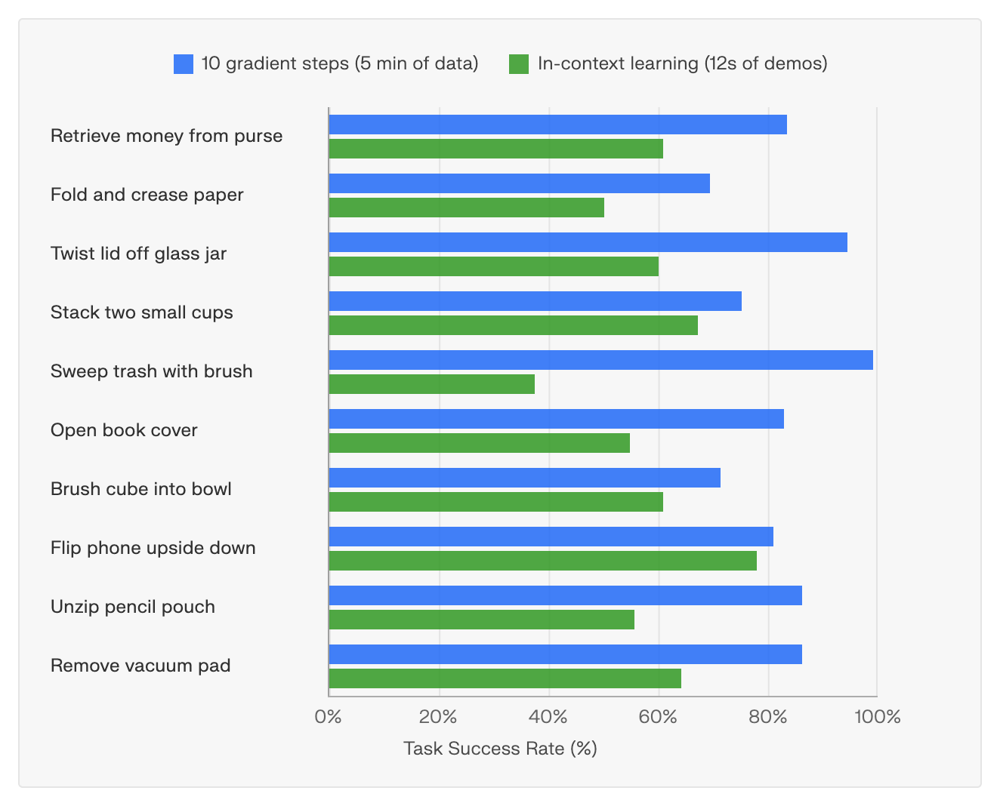
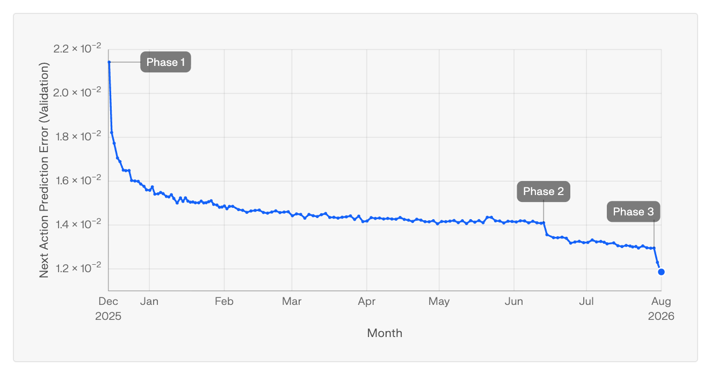
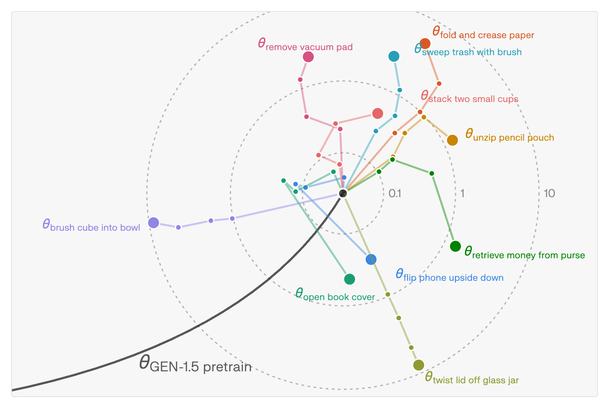

> 中文翻译与整理
> 原文：[GEN-1.5: Embodied Foundation Models are One-Shot Learners](https://generalistai.com/blog/gen-1.5)
> 作者：Generalist Team ｜ 发布：2026 年 8 月 19 日 ｜ 篇幅：原文约 17 分钟阅读
>
> 引用格式：
> Generalist Team, "GEN-1.5: Embodied Foundation Models are One-Shot Learners", Generalist AI Blog, Aug 2026.
>
> 文中视频均外链原文站点；图 2 / 图 3 / 图 4 为原文 JS 动态图表的截图。

---

## 引言（Introduction）

人类只看一两个例子，就能学会新的技能。GEN-1.5 展现出了这种能力的雏形——它能在数秒内学会一个新任务，只需单个示范，不需要梯度更新，也不需要微调。尽管这些任务本身简单、时序短，但这是第一个在规模化训练下涌现出单样本 / 少样本物理技能学习能力的模型。

对语言模型来说，「从一个或少数几个例子快速学会新任务」的能力是随 [GPT-3](https://arxiv.org/abs/2005.14165) 到来的标志性能力。在一系列语言任务上，GPT-3 无需训练、仅靠单样本上下文提示就达到约 45% 的平均准确率，少样本（约 100 个例子）下最高可达约 65%。GPT-3 之前的模型已经显露出零样本能力乃至初步的少样本结果，但 GPT-3 在少样本性能上的广度显著提升，同时在泛化能力上实现了当时的一次巨大跨越。

在机器人领域，「从一个或少数几个示范就把任务泛化开」这一目标的追寻已持续数十年——至少可以追溯到 1954 年 [Unimate 专利](https://patents.google.com/patent/US2988237A/en)的「牵引示教」（teach-by-guiding），以及 MIT 1970 年的 [Copy Demo](https://people.csail.mit.edu/bkph/phw_copy_demo.shtml)。大量工作（[包括我们自己的](https://generalistai.com/blog/the-robots-build-now-too)）展示过各种形式的上下文学习，但都局限在有限的任务变化范围内，或者受限于特定物体、特定任务类型、特定传感模态。而「从仅仅一个或几个示范中学到闭环的物理技能，并且在没有上述限制的前提下跨越广泛任务」，此前基本被认为遥不可及。

<figure style="flex:1 1 30%;min-width:200px;margin:0">
<video src="https://generalistai.com/assets/pages/blog/gen-1.5/assets/videos/wired_hands_marker_cup_with_label_8x.mp4" controls loop muted playsinline preload="none" width="100%"></video>
<figcaption style="font-size:.85em;text-align:center;opacity:.75">马克笔投杯（Marker Into Cup）</figcaption>
</figure>
<figure style="flex:1 1 30%;min-width:200px;margin:0">
<video src="https://generalistai.com/assets/pages/blog/gen-1.5/assets/videos/wired_hands_pour_bolts_with_label_8x.mp4" controls loop muted playsinline preload="none" width="100%"></video>
<figcaption style="font-size:.85em;text-align:center;opacity:.75">倒螺栓（Pour Bolts）</figcaption>
</figure>
<figure style="flex:1 1 30%;min-width:200px;margin:0">
<video src="https://generalistai.com/assets/pages/blog/gen-1.5/assets/videos/wired_hands_zipper_8x_with_label.mp4" controls loop muted playsinline preload="none" width="100%"></video>
<figcaption style="font-size:.85em;text-align:center;opacity:.75">拉拉链（Zipper）</figcaption>
</figure>

**图 1.** 语言模型与具身模型的上下文单样本学习。语言模型例子中，模型输出以绿色高亮；在具身的例子中，提示词是来自人类示范数据的一段 **sensorimotor 序列**，GEN-1.5 据此操控机器人完成任务。

---

## GEN-1.5 简介（Introducing GEN-1.5）

GEN-1.5 是一个多模态大模型，处理视频输入（30 秒记忆，并伴随其他传感器、语言和本体感知输入），输出 100 Hz 的动作轨迹。它的能力包括：

- **通过上下文提示实现单样本学习。** 给定单个示范中的 3-12 秒，模型在数秒内学会新任务，无需训练。我们把「在上下文窗口中使用 sensorimotor 样例」这种做法称为**物理提示**（physical prompting）。
  - **组合泛化。** 在上下文中给两段不同的物理提示，模型会把它们串成一个更长时序的连续行为。
  - **零样本 sim-to-real 迁移。** 在仿真中录制的示范可以作为真实世界任务的物理提示——尽管预训练数据里没有任何仿真数据。
  - **人到机器人的模仿。** 在某些情况下，人可以用自己的手在机器人相机视野内示范一个任务，模型随后用机器人的手复现它。
- **通过梯度下降实现少样本适配。** 模型可以在 1–5 分钟的数据（约 10–50 次示范）上，用 1–10 个梯度步微调到一个新任务。
- **即兴创造新策略与工具使用。** 模型在**行为策略**这一层级上泛化：为达成目标生成全新的轨迹；使用未见过的工具（刷子、簸箕等）为原本用其他工具示范过的任务创造新解法；即使提示或微调时只用某一只手，它也能双手通用地作业。

这些能力似乎是直接从「在海量物理交互数据上预训练」中涌现出来的。我们没有为其中任何一项做过针对性训练：没有为促进上下文学习而改动架构，没有内外层[元学习循环](https://arxiv.org/abs/1703.03400)去逼迫模型从极少数据中适应，也没有鼓励即兴发挥的[辅助目标](https://arxiv.org/abs/1802.06070)。

<figure style="flex:1 1 45%;min-width:260px;margin:0">
<video src="https://generalistai.com/assets/pages/blog/gen-1.5/assets/videos/top_down_human_jar.mp4" controls loop muted playsinline preload="none" width="100%"></video>
<figcaption style="font-size:.85em;text-align:center;opacity:.75">拧开玻璃罐盖 · 物理提示</figcaption>
</figure>
<figure style="flex:1 1 45%;min-width:260px;margin:0">
<video src="https://generalistai.com/assets/pages/blog/gen-1.5/assets/videos/top_down_robot_jar.mp4" controls loop muted playsinline preload="none" width="100%"></video>
<figcaption style="font-size:.85em;text-align:center;opacity:.75">拧开玻璃罐盖 · 模型 rollout</figcaption>
</figure>
<figure style="flex:1 1 45%;min-width:260px;margin:0">
<video src="https://generalistai.com/assets/pages/blog/gen-1.5/assets/videos/top_down_human_unzip.mp4" controls loop muted playsinline preload="none" width="100%"></video>
<figcaption style="font-size:.85em;text-align:center;opacity:.75">拉开笔袋拉链 · 物理提示</figcaption>
</figure>
<figure style="flex:1 1 45%;min-width:260px;margin:0">
<video src="https://generalistai.com/assets/pages/blog/gen-1.5/assets/videos/top_down_robot_unzip.mp4" controls loop muted playsinline preload="none" width="100%"></video>
<figcaption style="font-size:.85em;text-align:center;opacity:.75">拉开笔袋拉链 · 模型 rollout</figcaption>
</figure>
<figure style="flex:1 1 45%;min-width:260px;margin:0">
<video src="https://generalistai.com/assets/pages/blog/gen-1.5/assets/videos/top_down_human_brush.mp4" controls loop muted playsinline preload="none" width="100%"></video>
<figcaption style="font-size:.85em;text-align:center;opacity:.75">把方块刷进碗里 · 物理提示</figcaption>
</figure>
<figure style="flex:1 1 45%;min-width:260px;margin:0">
<video src="https://generalistai.com/assets/pages/blog/gen-1.5/assets/videos/top_down_robot_brush.mp4" controls loop muted playsinline preload="none" width="100%"></video>
<figcaption style="font-size:.85em;text-align:center;opacity:.75">把方块刷进碗里 · 模型 rollout</figcaption>
</figure>
<figure style="flex:1 1 45%;min-width:260px;margin:0">
<video src="https://generalistai.com/assets/pages/blog/gen-1.5/assets/videos/top_down_human_vacuum.mp4" controls loop muted playsinline preload="none" width="100%"></video>
<figcaption style="font-size:.85em;text-align:center;opacity:.75">取下真空吸盘 · 物理提示</figcaption>
</figure>
<figure style="flex:1 1 45%;min-width:260px;margin:0">
<video src="https://generalistai.com/assets/pages/blog/gen-1.5/assets/videos/top_down_robot_vacuum.mp4" controls loop muted playsinline preload="none" width="100%"></video>
<figcaption style="font-size:.85em;text-align:center;opacity:.75">取下真空吸盘 · 模型 rollout</figcaption>
</figure>

如图2所示，直接使用预训练模型、仅靠单样本上下文提示，平均成功率为 **59%（±10% 标准差）**。改用少样本学习后，在每个任务 5 分钟数据（约 50 次示范）上跑 **10 个梯度步**，成功率升至 **83%（±9% 标准差）**。在某些情况下，用同样的示范数据做上下文学习，效果反而**超过**在这些数据上跑 1–5 个梯度步。尽管任务简单、时序短，成功率也只算中等，但这是第一个展示出「仅凭单样本或少样本示范就能学会大量灵巧闭环物理任务」这一通用能力的模型。

**图 2.** GEN-1.5 学习短时序原子操作任务：每个任务 5 分钟数据上做 10 步梯度下降后平均成功率 83%；零梯度更新、仅用 3 到 12 秒示范数据、依靠涌现的上下文学习时为 59%。

---

## 面向机器人的预训练规模化（Scaling Pretraining for Robotics）

[GEN-0](https://generalistai.com/blog/gen-0) 展现了可预测的[缩放律](https://arxiv.org/abs/2001.08361)，[GEN-1](https://generalistai.com/blog/gen-1) 证明了模型可以被后训练到 99%+ 成功率的「精通」（mastery）水平，并展现出即兴智能的初步迹象。GEN-1.5 到现在已经**连续训练了八个多月**，各指标都在持续变好，新任务变得更省数据、更省算力、更通用。

**图 3.** GEN-1.5 预训练超过 8 个月，在验证集上的下一步动作预测误差跨越 3 个训练阶段持续下降。

随着训练的持续，我们开始试验「适配一个新任务最少需要多少微调步数」，发现模型可以从数百步，到数十步，最终到在仅仅一分钟数据上跑 **1 个梯度步**就学会新任务。于是我们进一步问：这个模型能不能**完全不训练**、纯靠上下文、零梯度步地学会新任务？它居然真的能——这件事本身，改变了我们对这类模型如何被使用、它们的潜在影响力，以及构建通用物理智能这条路该怎么走的看法。

---

## 上下文中的单样本学习（One-Shot Learning In-Context）

GEN-1.5 可以被「单个示范」提示：把示范插进它 30 秒的上下文窗口，窗口余下部分保存滚动的观测。**物理提示**是 sensorimotor 样例（即传感器数据 + 动作轨迹），既可以录自人类数据（用一对手持夹爪采集），也可以是机器人的 rollout。

<video src="https://generalistai.com/assets/pages/blog/gen-1.5/assets/videos/two_task_in_context.mp4" controls loop muted playsinline preload="none" width="100%"></video>

**物理提示工程（Physical prompt engineering）** 用的是一个拖拽界面，用来挑选要插入模型上下文窗口的示范。文中的实时录屏展示了连续用物理提示教会模型两个任务：(i) 拉开笔袋拉链，(ii) 从笔袋里取钱。

机器人天然是多模态的；就像人类学习一样，教机器人新东西有很多方式——(a) 示范 与 (b) 语言指令，大概是人类指定任务最自然的两种。语言对某些任务描述够用，但许多物理动作难以[用语言精确描述](https://generalistai.com/blog/physical-commonsense)（比如「两块乐高该怎么严丝合缝地扣上」，演示远比说清楚容易）。此外，用原生的观测与动作来提示任务，也是对 sensorimotor 理解更全面的测试：模型必须从示范中推断目标、复用已有知识，并在新的初始条件下即兴发挥。

### 物理提示工程带来的组合泛化（Compositional Generalization）

物理提示还可以**组合**。例如，把两个不同任务的示范放进上下文（各自独立录制，彼此之间没有过渡），GEN-1.5 能把它们串成一个连续行为：做完一个，顺势流入下一个。模型自己搭起了两者之间的桥，产生出**两段示范里都不存在**的中间动作（重新定位、重新抓取、错误恢复）。

<figure style="flex:1 1 30%;min-width:200px;margin:0">
<video src="https://generalistai.com/assets/pages/blog/gen-1.5/assets/videos/compose_prompt_a.mp4" controls loop muted playsinline preload="none" width="100%"></video>
<figcaption style="font-size:.85em;text-align:center;opacity:.75">物理提示 A（拉开拉链）</figcaption>
</figure>
<figure style="flex:1 1 30%;min-width:200px;margin:0">
<video src="https://generalistai.com/assets/pages/blog/gen-1.5/assets/videos/compose_prompt_b.mp4" controls loop muted playsinline preload="none" width="100%"></video>
<figcaption style="font-size:.85em;text-align:center;opacity:.75">物理提示 B（取钱）</figcaption>
</figure>
<figure style="flex:1 1 30%;min-width:200px;margin:0">
<video src="https://generalistai.com/assets/pages/blog/gen-1.5/assets/videos/compose_prompt.mp4" controls loop muted playsinline preload="none" width="100%"></video>
<figcaption style="font-size:.85em;text-align:center;opacity:.75">模型 rollout（A + B 串联）</figcaption>
</figure>

**组合物理提示。** 两个不同任务的示范：(a) 拉开笔袋拉链，(b) 取钱，被一起放进模型上下文。模型把它们串成一个连续行为，用两段提示中都没有的中间动作、错误恢复与双手协同来衔接。

在实践中，这打开了「**物理提示工程**」：与其去采集一整个复合任务的示范，不如从一个由短小、可复用的物理提示组成的小型库里把它拼出来。随着模型变强，在上下文中组合技能，可能成为编排长时序行为的一种实用方式——它就是语言提示里「串联指令」的物理对应物。

### 上下文学习实现零样本 sim-to-real 迁移（Zero-Shot Sim-to-Real Transfer）

上下文学习也能跨越 sim-to-real 鸿沟。提示可以完全由仿真经验构成（例如来自脚本策略、RL 智能体，或人在仿真中遥操作机器人），并用来提示真实机器人。需要澄清的是：「零样本 sim2real 迁移」通常指的是在仿真器里针对某个特定任务训练策略，然后在没有该任务真实数据的情况下把策略放到真实世界跑。而此处展示的这个案例中，模型**无论在仿真还是真实世界里都没有在该任务上训练过**。

<figure style="flex:1 1 45%;min-width:260px;margin:0">
<video src="https://generalistai.com/assets/pages/blog/gen-1.5/assets/videos/sim_to_real_sim.mp4" controls loop muted playsinline preload="none" width="100%"></video>
<figcaption style="font-size:.85em;text-align:center;opacity:.75">来自仿真的提示</figcaption>
</figure>
<figure style="flex:1 1 45%;min-width:260px;margin:0">
<video src="https://generalistai.com/assets/pages/blog/gen-1.5/assets/videos/sim_to_real_real.mp4" controls loop muted playsinline preload="none" width="100%"></video>
<figcaption style="font-size:.85em;text-align:center;opacity:.75">真实世界中的模型 rollout</figcaption>
</figure>

**零样本 sim2real 迁移。** 一段完全在仿真中录制的示范（左）被放进模型上下文作为物理提示，真实机器人便执行了该任务（右）——尽管预训练中零仿真数据。被提示出的行为还能像其他物理提示行为一样泛化：泛化到不同的手，以及真实场景中新的物体位置和尺寸。

GEN-1.5 的预训练不含任何仿真数据，既没有渲染视频也没有仿真动力学，但模型却能被仿真器的 rollout 有效提示。

### 人到机器人的上下文学习（Human-to-Robot In-Context Learning）

在某些情况下，上下文学习能完全跨越**本体差异**：一个人用自己的手示范任务，被机器人相机观测到，机器人随即就能复现出来。

<video src="https://generalistai.com/assets/pages/blog/gen-1.5/assets/videos/human_to_robot_in_context_learning.mp4" controls loop muted playsinline preload="none" width="100%"></video>

---

## 极少梯度步的适配（Few Gradient Step Adaptation）

GEN-1.5 也能用**极少的梯度步**（少至 1 到 10 步）适配到新的物理任务。通常，把以往的机器人模型训练到一个新任务需要几万个梯度步（有时还要高上几个数量级），而[基础模型](https://arxiv.org/abs/2108.07258)的一项标志性能力，就是可以用少量微调迅速适配到新任务。

**图 4.** 少步适配把预训练权重朝着每个任务各不相同的方向移动；图为经典 MDS 嵌入，权重之间的两两 L2 距离以预训练模型为中心、按对数尺度径向排布。

重要的是，如此之小的训练步数意味着任务专用算力少了好几个数量级，也带来了一种比重度微调灵活得多的任务适配视角。把它描述成极低数据量下的「[测试时训练](https://arxiv.org/abs/2411.07279)（test-time training）」可能更贴切。测试时训练通常要用几十个梯度步；GEN-1.5 学一个新物理任务只需要 5 分钟数据上的 1–10 步。10 步对模型权重的改动**小于 0.15%**，这说明微调只是**轻微重构了模型中已经存在的知识**，而非构建新的表征。

在 10 步适配的实验中，我们从 5 分钟数据里采样序列，用与预训练类似的超参做梯度下降。在最极端的单步设定下，从一分钟数据中采样，任务成功率为 **66.5%**，且性能随更大 batch size 和更高学习率而提升。我们并没有对这个流程做调参，也没有做针对适配的超参搜索；这些结果基本是开箱即用的。

---

## 物理泛化（Physical Generalization）

对上面的每个任务，微调后的模型泛化能力都远超其示范范围——不只是泛化到新的本体、新的物体实例和新环境，还泛化到**为同一目标采用根本不同的操作策略**：换用别的抓法与动作、清除障碍物，以及使用微调数据中不存在的工具。

<figure style="flex:1 1 30%;min-width:200px;margin:0">
<video src="https://generalistai.com/assets/pages/blog/gen-1.5/assets/videos/wide_brush_block_bowl_1.mp4" controls loop muted playsinline preload="none" width="100%"></video>
</figure>
<figure style="flex:1 1 30%;min-width:200px;margin:0">
<video src="https://generalistai.com/assets/pages/blog/gen-1.5/assets/videos/wide_brush_block_bowl_2.mp4" controls loop muted playsinline preload="none" width="100%"></video>
</figure>
<figure style="flex:1 1 30%;min-width:200px;margin:0">
<video src="https://generalistai.com/assets/pages/blog/gen-1.5/assets/videos/wide_brush_block_bowl_3.mp4" controls loop muted playsinline preload="none" width="100%"></video>
</figure>

拿到簸箕后的三次 rollout：模型用簸箕把方块铲起来倒进碗里，而非按示范去「扫」。

**新工具使用的即兴发挥。** 在一个例子里，我们示范了用刷子把方块扫进碗中，并在 5 分钟的人类示范上微调模型。模型随后自己想出了用刷子之外的多种工具完成任务的办法。给它一根香蕉，它就把香蕉当作临时刷子用。而给它一个簸箕时，模型表现出了与示范更大的策略性偏离：它会用各种方式**用簸箕把方块铲起来、倒进碗里**。无论是微调数据，还是据我们所知的预训练数据，都不包含这样使用簸箕的情形；预训练中最接近的样例与该任务也相去甚远。拿到簸箕，模型开箱即用地组合出了一套全新的接触序列来完成任务，且没有任何语言引导。

**香蕉当临时刷子。** 即兴用香蕉把方块扫进碗里。

<video src="https://generalistai.com/assets/pages/blog/gen-1.5/assets/videos/banana_block_bowl_improv.mp4" controls loop muted playsinline preload="none" width="100%"></video>

**多个方块。** 把多个方块刷进碗里。

<video src="https://generalistai.com/assets/pages/blog/gen-1.5/assets/videos/brush_many_blocks_bowl.mp4" controls loop muted playsinline preload="none" width="100%"></video>

**双手通用。** 尽管示范只用了一只手，模型两只手都能刷。

<video src="https://generalistai.com/assets/pages/blog/gen-1.5/assets/videos/ambidextrous_brush_block_bowl.mp4" controls loop muted playsinline preload="none" width="100%"></video>

**微调数据。** 人类示范「把方块刷进碗里」的样例（模型视角）。

<video src="https://generalistai.com/assets/pages/blog/gen-1.5/assets/videos/human_brush_block_bowl.mp4" controls loop muted playsinline preload="none" width="100%"></video>

**预训练中最相似的任务。** 在 1,891,392 个场景上用最近邻语言检索找出的近似最接近活动。

<figure style="flex:1 1 22%;min-width:170px;margin:0">
<video src="https://generalistai.com/assets/pages/blog/gen-1.5/assets/videos/brush_block_bowl_neighbor1.mp4" controls loop muted playsinline preload="none" width="100%"></video>
</figure>
<figure style="flex:1 1 22%;min-width:170px;margin:0">
<video src="https://generalistai.com/assets/pages/blog/gen-1.5/assets/videos/brush_block_bowl_neighbor2.mp4" controls loop muted playsinline preload="none" width="100%"></video>
</figure>
<figure style="flex:1 1 22%;min-width:170px;margin:0">
<video src="https://generalistai.com/assets/pages/blog/gen-1.5/assets/videos/brush_block_bowl_neighbor3.mp4" controls loop muted playsinline preload="none" width="100%"></video>
</figure>
<figure style="flex:1 1 22%;min-width:170px;margin:0">
<video src="https://generalistai.com/assets/pages/blog/gen-1.5/assets/videos/brush_block_bowl_neighbor4.mp4" controls loop muted playsinline preload="none" width="100%"></video>
</figure>

「在意外情况下即兴发挥」的能力，似乎是模型掌握新任务的核心机制：它能纠正自己的错误，有时甚至在错误发生之前。我们最早在 [GEN-1](https://generalistai.com/blog/gen-1) 中观察到这种行为的痕迹。在 GEN-1.5 中它更频繁也更复杂，而且**微调梯度步数越少，这种能力越强**——推测是因为轻度适配的模型更贴近其预训练先验，当情境偏离示范时可以调用更广的行为库。

**应对障碍。** 尽管模型只被微调去「把方块放进碗里」，它却似乎能移开障碍（比如盖住碗的一张纸）来完成任务，有时还会把纸放回碗上。在用于微调的 5 分钟任务数据里没有任何纸盖着碗的情形（该模型只微调了 1 个梯度步），据我们所知预训练数据中也没有这个设定下的此类任务。

<figure style="flex:1 1 30%;min-width:200px;margin:0">
<video src="https://generalistai.com/assets/pages/blog/gen-1.5/assets/videos/cube_in_bowl_human.mp4" controls loop muted playsinline preload="none" width="100%"></video>
<figcaption style="font-size:.85em;text-align:center;opacity:.75">微调数据（无纸张）</figcaption>
</figure>
<figure style="flex:1 1 30%;min-width:200px;margin:0">
<video src="https://generalistai.com/assets/pages/blog/gen-1.5/assets/videos/paper_cube_in_bowl.mp4" controls loop muted playsinline preload="none" width="100%"></video>
<figcaption style="font-size:.85em;text-align:center;opacity:.75">模型 rollout：移开纸张</figcaption>
</figure>
<figure style="flex:1 1 30%;min-width:200px;margin:0">
<video src="https://generalistai.com/assets/pages/blog/gen-1.5/assets/videos/paper_cube_in_bowl_robot_view.mp4" controls loop muted playsinline preload="none" width="100%"></video>
<figcaption style="font-size:.85em;text-align:center;opacity:.75">同一 rollout · 机器人视角</figcaption>
</figure>

更多有趣的涌现即兴行为：

**移除阻碍物。** 当一块乐高意外卡在指尖上时，模型用另一只手把它弄掉。

<figure style="flex:1 1 45%;min-width:260px;margin:0">
<video src="https://generalistai.com/assets/pages/blog/gen-1.5/assets/videos/lego_stuck_robot.mp4" controls loop muted playsinline preload="none" width="100%"></video>
<figcaption style="font-size:.85em;text-align:center;opacity:.75">模型 rollout</figcaption>
</figure>
<figure style="flex:1 1 45%;min-width:260px;margin:0">
<video src="https://generalistai.com/assets/pages/blog/gen-1.5/assets/videos/lego_stuck_human.mp4" controls loop muted playsinline preload="none" width="100%"></video>
<figcaption style="font-size:.85em;text-align:center;opacity:.75">微调数据</figcaption>
</figure>

**双手协同。** 训练数据里只用一只手，但模型有时会用两只手去转罐盖（一种根本不同的接触与运动策略）。

<figure style="flex:1 1 45%;min-width:260px;margin:0">
<video src="https://generalistai.com/assets/pages/blog/gen-1.5/assets/videos/twist_lid_expected.mp4" controls loop muted playsinline preload="none" width="100%"></video>
<figcaption style="font-size:.85em;text-align:center;opacity:.75">预期的模型 rollout（单手）</figcaption>
</figure>
<figure style="flex:1 1 45%;min-width:260px;margin:0">
<video src="https://generalistai.com/assets/pages/blog/gen-1.5/assets/videos/twist_lid_bimanual.mp4" controls loop muted playsinline preload="none" width="100%"></video>
<figcaption style="font-size:.85em;text-align:center;opacity:.75">即兴的模型 rollout（双手）</figcaption>
</figure>

**整理倾向。** 只被微调去「把一个方块放进一个碗」的模型，有时会表现出更一般的行为，比如按颜色或类别给方块分类（这是[物理常识](https://generalistai.com/blog/physical-commonsense)的一种泛化形式）。

<figure style="flex:1 1 45%;min-width:260px;margin:0">
<video src="https://generalistai.com/assets/pages/blog/gen-1.5/assets/videos/cube_sorting_1.mp4" controls loop muted playsinline preload="none" width="100%"></video>
</figure>
<figure style="flex:1 1 45%;min-width:260px;margin:0">
<video src="https://generalistai.com/assets/pages/blog/gen-1.5/assets/videos/cube_sorting_2.mp4" controls loop muted playsinline preload="none" width="100%"></video>
</figure>

**泛化到新物体。** 在 5 分钟数据上微调 10 个梯度步学会「拧开罐盖」的模型，能泛化到从未见过的杯子和瓶子——这需要推理双手该抓在哪里，以及手腕该如何以特定方式旋转才能拧开每一种盖子。

<figure style="flex:1 1 22%;min-width:170px;margin:0">
<video src="https://generalistai.com/assets/pages/blog/gen-1.5/assets/videos/twist_lid_improv_jar.mp4" controls loop muted playsinline preload="none" width="100%"></video>
</figure>
<figure style="flex:1 1 22%;min-width:170px;margin:0">
<video src="https://generalistai.com/assets/pages/blog/gen-1.5/assets/videos/twist_lid_improv_bottle.mp4" controls loop muted playsinline preload="none" width="100%"></video>
</figure>
<figure style="flex:1 1 22%;min-width:170px;margin:0">
<video src="https://generalistai.com/assets/pages/blog/gen-1.5/assets/videos/twist_lid_improv_togocup.mp4" controls loop muted playsinline preload="none" width="100%"></video>
</figure>
<figure style="flex:1 1 22%;min-width:170px;margin:0">
<video src="https://generalistai.com/assets/pages/blog/gen-1.5/assets/videos/twist_lid_improv_container.mp4" controls loop muted playsinline preload="none" width="100%"></video>
</figure>

---

## 展望（Looking Ahead）

预训练越多，适配就越快、越便宜、越通用。我们还看不到这条曲线在哪里趋于饱和，一旦越过某个预训练阈值，**适配的成本就变得微不足道**。从几秒数据中涌现的上下文学习，或者在一分钟示范上跑一个梯度步，已经不再是传统意义上的任务专用训练。它更像是用极小的算力去**提醒模型一件它几乎已经知道的事**。这件事本身能成立，就改变了我们对这类模型如何被使用、其潜在影响，以及构建通用物理智能这条路该怎么走的看法。

几十年来，机器人一直被作为「通用」机器来营销——原则上什么都能干，以此对照过去的单一用途工厂自动化。但这个承诺始终附带一个前提：得有专家来编程，而那需要数月工夫和专门知识。如果与机器人打交道简化为**只要做给它看**，那么两件事就发生了根本变化：机器人变得有用需要多久（是秒，不是月），以及**谁**能与机器人协作（任何人）。

我们仍处在「构建物理 AGI 并让所有人都用得上」这一使命的早期。

---

## 参考文献（References）

1. [Language Models are Few-Shot Learners (Brown et al., 2020)](https://arxiv.org/abs/2005.14165)
2. [Language Models are Unsupervised Multitask Learners (Radford et al., 2019)](https://cdn.openai.com/better-language-models/language_models_are_unsupervised_multitask_learners.pdf)
3. [Programmed Article Transfer, U.S. Patent 2,988,237 (Devol, filed 1954)](https://patents.google.com/patent/US2988237A/en)
4. [The MIT AI Lab Copy Demo (Winston et al., 1970)](https://people.csail.mit.edu/bkph/phw_copy_demo.shtml)
5. [The Robots Build Now, Too (Generalist, 2025)](https://generalistai.com/blog/the-robots-build-now-too)
6. [In-Context Imitation Learning via Next-Token Prediction (Fu et al., 2024)](https://arxiv.org/abs/2408.15980)
7. [Behavior Prompting Policy: Demonstrations as Prompts for Manipulation (Patel et al., 2026)](https://arxiv.org/abs/2606.30457)
8. [RoboTTT: Context Scaling for Robot Policies (Jiang et al., 2026)](https://arxiv.org/abs/2607.15275)
9. [Instant Policy: In-Context Imitation Learning via Graph Diffusion (Vosylius & Johns, 2024)](https://arxiv.org/abs/2411.12633)
10. [Native Video-Action Pretraining for Generalizable Robot Control (Zhang et al., 2026)](https://arxiv.org/abs/2607.08639)
11. [Coarse-to-Fine Imitation Learning: Robot Manipulation from a Single Demonstration (Johns, 2021)](https://arxiv.org/abs/2105.06411)
12. [Model-Agnostic Meta-Learning for Fast Adaptation of Deep Networks (Finn et al., 2017)](https://arxiv.org/abs/1703.03400)
13. [Diversity is All You Need: Learning Skills without a Reward Function (Eysenbach et al., 2018)](https://arxiv.org/abs/1802.06070)
14. [GEN-0: Embodied Foundation Models That Scale with Physical Interaction (Generalist, 2025)](https://generalistai.com/blog/gen-0)
15. [Scaling Laws for Neural Language Models (Kaplan et al., 2020)](https://arxiv.org/abs/2001.08361)
16. [GEN-1: Scaling Embodied Foundation Models to Mastery (Generalist, 2026)](https://generalistai.com/blog/gen-1)
17. [Data Distributional Properties Drive Emergent In-Context Learning in Transformers (Chan et al., 2022)](https://arxiv.org/abs/2205.05055)
18. [Large Language Models as General Pattern Machines (Mirchandani et al., 2023)](https://arxiv.org/abs/2307.04721)
19. [One-Shot Imitation Learning (Duan et al., 2017)](https://arxiv.org/abs/1703.07326)
20. [The Dark Matter of Robotics: Physical Commonsense (Generalist, 2026)](https://generalistai.com/blog/physical-commonsense)
21. [On the Opportunities and Risks of Foundation Models (Bommasani et al., 2021)](https://arxiv.org/abs/2108.07258)
22. [The Surprising Effectiveness of Test-Time Training for Abstract Reasoning (Akyürek et al., 2024)](https://arxiv.org/abs/2411.07279)

---

## 译注（术语与存疑处）

| 原文 | 译法 | 说明 |
|-|-|-|
| physical prompting / physical prompt | 物理提示 | 全文核心新造词，指把「传感器数据 + 动作轨迹」的感觉运动样例塞进上下文窗口 |
| sensorimotor sequence | 感觉运动序列 |  |
| in-context learning | 上下文学习 | 保留 ICL 惯用译法 |
| mastery | 精通 | GEN-1 博客里的专有说法（99%+ 成功率） |
| improvisation | 即兴发挥 |  |
| ambidexterity | 双手通用 / 左右手皆可 | 原文强调「示范只用一只手，模型两只手都会」 |
| embodiment gap | 本体差异 | 人手 → 机器人手 |
| burstiness | 突发性 | Chan et al. 2022 的术语，与齐普夫分布并列 |
| test-time training | 测试时训练 |  |
| data engine | 数据引擎 | Generalist 自称的采集 + 训练闭环 |
| handheld grippers | 手持夹爪 | 人类采集设备（UMI 类） |
| held-out task | 留出任务 |  |
