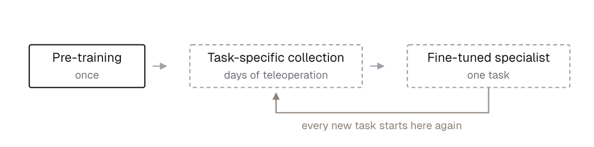
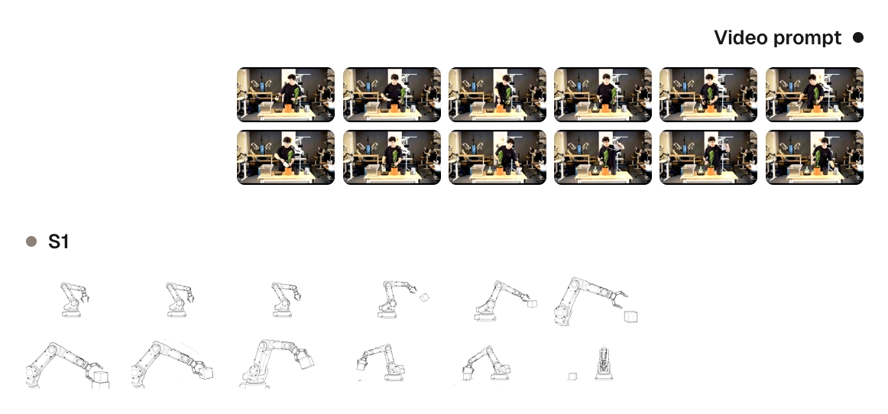
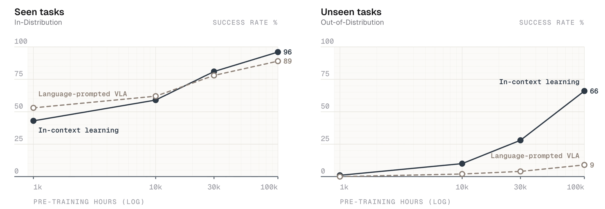
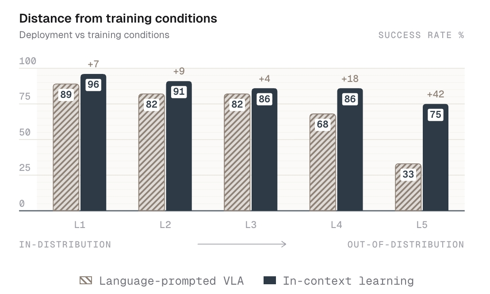
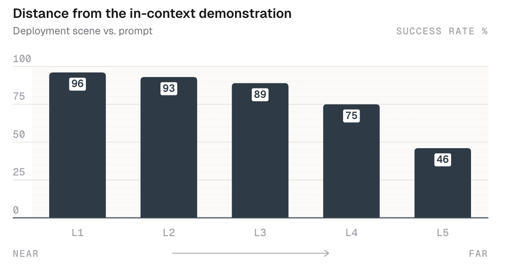
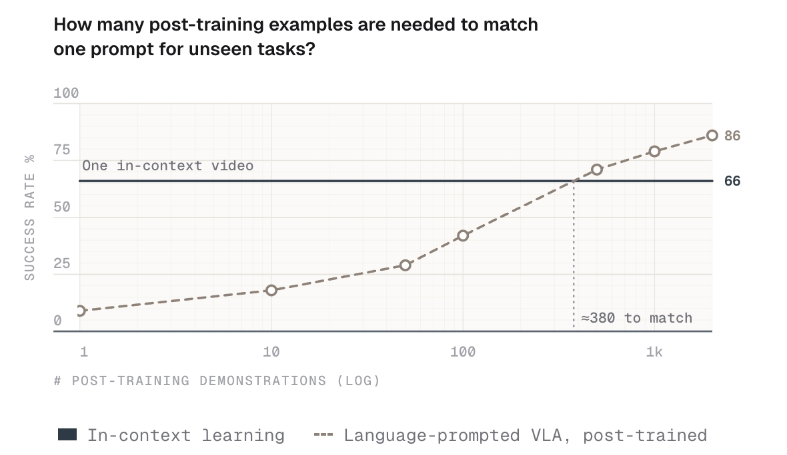

> Skild AI，2026 年 8 月　原文：https://www.skild.ai/blogs/s1
> 副标题：未见过的任务 · 10 分钟长程 · 一段视频提示 · 无需后训练
> 全文约 13 分钟阅读

---

## 引言（Introduction）

语言模型的演进，为「如何把一个有能力的模型变成有用的通用工具」提供了一张蓝图。早期基于 Transformer 的做法，比如 BERT（Devlin et al., 2019），在理解语言上已经很有效，但每一个新应用仍然要重新采集数据、重新微调模型。从这类早期语言模型到 ChatGPT 的那次关键跃迁，是由一种根本不同的学习范式驱动的——它后来被称作**上下文学习（in-context learning, ICL）**，在技术圈外则被叫作 prompting。正是这个能力，把 GPT-1、GPT-2 这样的研究原型和今天的前沿语言模型区分开：用户可以完全通过 prompt 引入一个全新的概念，而模型无需改动任何权重就能给出合理的响应。

**机器人领域到目前为止仍卡在 BERT 时代。** 过去几年的机器人研究已经表明，我们可以用深度神经网络学到一系列复杂行为。但要稳健地执行一个新任务，仍然需要采集数小时的数据、再微调出一个专用策略。这个范式虽然被广泛接受，但也隐藏了一个令人不安的事实：要为中等复杂度的任务学出稳健策略，后训练数据必须在**部署环境下**达到数十甚至数百小时。更进一步，已有研究表明，当后训练数据足够大、且对任务覆盖足够稠密时，即使完全不做预训练、从零训起的策略，也能追平一个经过后训练的基础模型的峰值性能（Oh et al., 2026）。**那预训练的意义到底是什么？**

> **图 1** 传统机器人学习流水线：预训练一次 → 针对任务采集数据（数天遥操作）→ 微调出单任务专家。每一个新任务都要从头再来一遍。

我们认为，预训练的一大主要目的是为机器人带来当年从 BERT 到 GPT-3（Brown et al., 2020）的那次同样的转变：**上下文学习**，即从一个或少数几个样例中立刻学会的能力。一年前，我们发布过一个用于**运动控制（locomotion）**的 in-context learner，它通过在 prompt 里不断累积实时经验来完成自适应（Liu et al., 2025）。今天我们分享的是旗舰款机器人基础模型 **S1** 在**操作（manipulation）**上的结果——S1 从设计之初就是作为一个 in-context learner 构建的。给它看一段任务视频，无论长短、无论见过没见过，它就去执行。

这篇博客是接下来几个月系列文章的第一篇，聚焦于分析 S1 的上下文学习能力，后续的文章会深入讲 S1 是怎么训练的。

---

## 为什么机器人需要上下文学习？

> **TL;DR** —— 任务由**视频演示**指定，而不是语言。跨多样任务的预训练迫使模型从演示中学会「意图」，于是**一套权重**就能执行未见过的任务，无需微调。

机器人上下文学习的目标和语言模型没有区别：把任务演示给它看，机器人就该执行——哪怕它从没见过这个任务。真正难的问题不是「上下文学习是什么意思」，而是**我们这个领域该如何评测一个模型的上下文能力**。

当我们请一个人做简单的原子动作时，语言通常就够了：「把杯子递给我」不需要多说什么。但一旦任务变得精细、微妙或者长程，我们就不再是「描述」，而是开始「示范」。折一张床笠、把蛋白打到硬性发泡、打一个绳结——这些都不是靠一句话能学会的。机器人同理：如果一个基础模型执行的是原子动作，它通常并不需要看视频，用语言提示就行。这个共识被 Jim Fan 表述得很精辟：

> 一旦你有了足够的数据，很多行为其实可以是零样本的。比如说，抓取一个新物体你甚至都不需要微调。只要训练分布里有相似的场景，模型「就是知道」该怎么做。上下文学习到底成不成立，也取决于测试离训练有多远。

因此，理解 ICL 必须沿着**两个独立的轴**来看：

1. 被演示的任务在预训练中**见过**（分布内, in-distribution）还是**完全没见过**（分布外, out-of-distribution）；
2. 被演示的任务是**短程原子动作**（5–25 秒），还是**长程任务**——需要学会新技能，或者以前所未见的方式把技能组合起来。

我们发现，同期的操作类上下文学习工作（Generalist AI, 2026）、（Jiang et al., 2026）覆盖的任务基本都是短程的、或者已经存在于预训练分布中的。**这是机器人基础模型第一次在预训练中完全没见过、且极长程（长达 10 分钟）的任务上展示出上下文学习能力。**

---

## S1: An In-Context Learner

> **TL;DR** —— S1 把「目标任务的上下文视频演示」翻译成机器人动作。

我们的高层训练配方在概念上很简单：在**任务仅通过上下文演示来指定**的 episodic 数据上做预训练。由于演示可能来自不同的场景、不同的视角、甚至不同的本体（embodiment），策略必须隐式地学会演示者的**意图**、**功能对应关系（functional correspondences）**以及**任务进度**，才能预测出恰当的动作。

> **图 2** 任务演示进入上下文窗口，策略把它翻译到自己的本体和当前场景上

**任务的多样性和规模，是这些基础 ICL 能力涌现的驱动力。** 在高多样性的状态下，场景的歧义必须靠「注意上下文」来消解，这就激励模型去学会**如何从演示中学习**。用元学习的话说：预训练是**外循环**，教会策略怎样从上下文中学习；推理时，演示驱动**内循环**，而不改变任何权重。结果是一套策略，既能在新配置下做熟悉的行为，也能通过上下文学习做从未见过的行为。**不微调，不后训练。这篇博客里展示的每一个例子，都出自同一套模型权重。**

### S1 从上下文里学到了什么？

S1 的上下文学习能力在两个难度轴上尤为突出：**技能新颖度**和**任务长度**。通过 prompt 给一段视频演示，S1 可以（1）执行预训练中不存在的新原子技能；（2）通过以前所未见的方式组合原子技能，解决超过 10 分钟的长程任务。我们对这两方面都做了评测。

**学习分布外技能。** 机器人数据依然稀缺且昂贵，很多重要任务落在预训练分布之外。因此分布外的 ICL 对通用机器人策略是必需的。ICL 预训练中丰富的视频上下文，鼓励模型涌现出一个从**演示到动作**的隐式映射，从而在测试时学会新行为。

**跨长程任务的组合。** 从上下文出发执行一个 10 分钟长的任务，需要几种在短程任务上根本测不出来的能力：把操作原语串成新的序列、跟踪任务进度、以及从错误中恢复。这些能力天然契合配置良好的 ICL 预训练，也正是成功执行长任务所必需的。

---

## 数据引擎（The Data Engine）

> **TL;DR** —— 在可扩展性、多样性、硬件贴近度这三条上，没有任何单一数据源能通吃，所以我们把它们**全都**扩起来，再做策略性组合。

高质量数据是任何基础模型的核心。机器人领域的挑战在于，在三条真正重要的轴上，没有单一数据源是最优的：

- **硬件贴近度（Hardware proximity）**：数据与部署硬件有多像。
- **多样性（Diversity）**：覆盖了多少任务、场景和行为。
- **可扩展性（Scalability）**：再多采一些的代价有多大。

每一种主要的机器人数据源都在这三条轴之间做权衡。遥操作离机器人最近，但扩展性最差；第一人称视频（egocentric video）最容易扩展，但与机器人之间的域差距最大。**没有哪个能三条全赢，所以押注单一数据源是短视的。** Skild 一直在内部把这几类数据全都往上扩，这方面很快会有更多分享。

| 数据源 | 硬件贴近度 | 多样性 | 可扩展性 |
|-|-|-|-|
| 机器人遥操作（Robot teleop） | 高 | 低 | 低 |
| UMI | 中 | 中 | 中 |
| 第一人称视频（Egocentric video） | 低 | 高 | 高 |
| 仿真（Simulation） | 中 | 低 | 高 |

> **图 3** 每一种机器人数据源都在三条关键轴上做权衡。遥操作最贴近硬件、扩展性最差；第一人称视频正好相反。

---

## S1 实战（S1 In Action）

> **TL;DR** —— S1 能执行长达十分钟、且不在训练数据中的任务。相比语言提示，ICL 的扩展收益在**见过的任务**上适中，但在**未见过的任务**上带来 **7 倍**的性能提升。

### 见过的任务

我们广泛的操作类预训练任务基底带来了大量能力。下面这些分布内的 rollout 采样自预训练池直接教过的原语——S1 之后可以把它们组合起来完成未见过的任务。

<video src="https://assets.skild.ai/site/v1/blog/sb-812a99baf442e4fb5939/lab-cup.mp4" poster="https://assets.skild.ai/site/v1/blog/sb-812a99baf442e4fb5939/lab-cup-poster.jpg" controls loop muted playsinline preload="none" style="flex:1 1 220px;min-width:0"></video>
<video src="https://assets.skild.ai/site/v1/blog/sb-812a99baf442e4fb5939/flakes-macro.mp4" poster="https://assets.skild.ai/site/v1/blog/sb-812a99baf442e4fb5939/flakes-macro-poster.jpg" controls loop muted playsinline preload="none" style="flex:1 1 220px;min-width:0"></video>
<video src="https://assets.skild.ai/site/v1/blog/sb-812a99baf442e4fb5939/bandaid-elbow.mp4" poster="https://assets.skild.ai/site/v1/blog/sb-812a99baf442e4fb5939/bandaid-elbow-poster.jpg" controls loop muted playsinline preload="none" style="flex:1 1 220px;min-width:0"></video>
<video src="https://assets.skild.ai/site/v1/blog/sb-812a99baf442e4fb5939/pack-lift.mp4" poster="https://assets.skild.ai/site/v1/blog/sb-812a99baf442e4fb5939/pack-lift-poster.jpg" controls loop muted playsinline preload="none" style="flex:1 1 220px;min-width:0"></video>

<video src="https://assets.skild.ai/site/v1/blog/sb-812a99baf442e4fb5939/cable-loop.mp4" poster="https://assets.skild.ai/site/v1/blog/sb-812a99baf442e4fb5939/cable-loop-poster.jpg" controls loop muted playsinline preload="none" style="flex:1 1 260px;min-width:0"></video>
<video src="https://assets.skild.ai/site/v1/blog/sb-812a99baf442e4fb5939/ribbon-retie.mp4" poster="https://assets.skild.ai/site/v1/blog/sb-812a99baf442e4fb5939/ribbon-retie-poster.jpg" controls loop muted playsinline preload="none" style="flex:1 1 260px;min-width:0"></video>
<video src="https://assets.skild.ai/site/v1/blog/sb-812a99baf442e4fb5939/syringe-hold.mp4" poster="https://assets.skild.ai/site/v1/blog/sb-812a99baf442e4fb5939/syringe-hold-poster.jpg" controls loop muted playsinline preload="none" style="flex:1 1 260px;min-width:0"></video>

*上面 7 段是 S1 在多种分布内任务上的自主执行：实验室移液杯、麦片特写、贴创可贴、装包提起、绕线圈、重新系丝带、握持注射器。*

### 长程 · 未见过的任务

下面是四个 S1 **从未训练过**的任务：**植物换盆、煎薄饼、手冲咖啡、套件装配（kit assembly）**。这些任务最长运行十分钟，跨越数十个操作步骤，且**仅由一段视觉演示驱动**。每组左侧是「它看过的那一段演示」，右侧是 S1 的自主执行。

**翻薄饼**

<video src="https://assets.skild.ai/site/v1/blog/sb-812a99baf442e4fb5939/pancakes-prompt.mp4" poster="https://assets.skild.ai/site/v1/blog/sb-812a99baf442e4fb5939/pancakes-prompt-poster.jpg" controls loop muted playsinline preload="none" style="flex:1 1 320px;min-width:0"></video>
<video src="https://assets.skild.ai/site/v1/blog/sb-812a99baf442e4fb5939/pancakes.mp4" poster="https://assets.skild.ai/site/v1/blog/sb-812a99baf442e4fb5939/pancakes-poster.jpg" controls loop muted playsinline preload="none" style="flex:1 1 320px;min-width:0"></video>

**手冲咖啡**

<video src="https://assets.skild.ai/site/v1/blog/sb-812a99baf442e4fb5939/coffee-prompt.mp4" poster="https://assets.skild.ai/site/v1/blog/sb-812a99baf442e4fb5939/coffee-prompt-poster.jpg" controls loop muted playsinline preload="none" style="flex:1 1 320px;min-width:0"></video>
<video src="https://assets.skild.ai/site/v1/blog/sb-812a99baf442e4fb5939/coffee.mp4" poster="https://assets.skild.ai/site/v1/blog/sb-812a99baf442e4fb5939/coffee-poster.jpg" controls loop muted playsinline preload="none" style="flex:1 1 320px;min-width:0"></video>

**套件装配**

<video src="https://assets.skild.ai/site/v1/blog/sb-812a99baf442e4fb5939/kitting-prompt.mp4" poster="https://assets.skild.ai/site/v1/blog/sb-812a99baf442e4fb5939/kitting-prompt-poster.jpg" controls loop muted playsinline preload="none" style="flex:1 1 320px;min-width:0"></video>
<video src="https://assets.skild.ai/site/v1/blog/sb-812a99baf442e4fb5939/kitting.mp4" poster="https://assets.skild.ai/site/v1/blog/sb-812a99baf442e4fb5939/kitting-poster.jpg" controls loop muted playsinline preload="none" style="flex:1 1 320px;min-width:0"></video>

**植物换盆**

<video src="https://assets.skild.ai/site/v1/blog/sb-812a99baf442e4fb5939/potting-prompt.mp4" poster="https://assets.skild.ai/site/v1/blog/sb-812a99baf442e4fb5939/potting-prompt-poster.jpg" controls loop muted playsinline preload="none" style="flex:1 1 320px;min-width:0"></video>
<video src="https://assets.skild.ai/site/v1/blog/sb-812a99baf442e4fb5939/potting.mp4" poster="https://assets.skild.ai/site/v1/blog/sb-812a99baf442e4fb5939/potting-poster.jpg" controls loop muted playsinline preload="none" style="flex:1 1 320px;min-width:0"></video>

在传统流程里，为一个新的操作任务部署策略，起步就是数小时遥操作加一次针对该任务的微调。**教会 S1 一件新事情只要几分钟。** 下面复现我们做植物换盆任务的时间线。这次 ICL 实验从晚上 8:54 开始，当时土、花盆、洒水壶和植物刚送到办公室。我们大部分时间花在搬家具、布置场景上。**从演示到自主执行只用了 11 分钟。**

| 时间 | 事件 |
|-|-|
| 8:54 PM | 土、花盆、洒水壶和植物送到办公室 |
| 9:16 PM | 场景布置完成，开始录制 |
| 9:22 PM | 录完一段第一人称人类视频演示 |
| 9:27 PM | S1 开始在硬件上自主执行任务 |

### ICL scaling laws

这一节把 ICL 式的演示提示，与传统 VLA 所普及的语言提示做对比。我们在预训练数据池的一个**过滤子集**上做了消融实验，在 **1k 到 100k 小时**的数据集上分别训练 ICL 策略和语言条件 VLA 策略。两个模型使用**完全相同**的数据、架构（除了 prompt embedding 部分）和算力。

数据集质量至关重要，盲目地用低质量或含噪数据做扩展可能是**有害的**。**我们每花一美元采数据，就花三美元做质量控制。** 每一个进入预训练的数据都要经过低层精度、任务连贯性、标注保真度的筛查。

我们在两个内部基准套件上评测：一个由预训练分布内的任务组成，另一个由未见过的任务构成。我们报告的是**所有任务上的平均逐步成功率（average per-step success rate）**。这些任务都是长程的（4–8 分钟）。为了保证每一步都能被打分，我们在策略 rollout 过程中使用**人工干预**来从失败中恢复。这个干预主要用在 VLA 基线上，因为否则基线连一次完整的长任务都走不完。

> **图 4** 成功率随预训练规模的变化，上下文学习 vs 语言提示 VLA 策略

**见过的任务。** 传统 VLA 在任务于预训练中见过时表现最好（图 4 左）。事实上，在 1k 小时预训练时，语言条件策略的成功率是 **53%**，而 ICL 是 **43%**。然而，随着预训练规模扩大，S1 的 ICL 反超传统 VLA，达到 **96% 的准确率**——对长程任务而言这是非常高的。这是一个令人鼓舞的信号：**即便在见过的任务上，ICL 也胜过 VLA。** 我们把这个优势归因于**语言的歧义性**：语言指令可以对应许多种有效的执行方式，而一段演示指定了一个明确的做法。

**未见过的任务。** 两种提示方式的巨大差距，随着预训练数据扩大而在分布外任务上显现出来。语言提示的性能随预训练缓慢上升，在 100k 小时数据时只有 **9%** 的成功率。我们的 ICL 模型吸收数据的效率高得多，在同样数据量下达到 **66%**。令人意外的是，**ICL 与 VLA 之间的差距随预训练数据增加而呈指数级拉大**——这对 ICL 的 scaling law 给出了很大希望。我们把它归因于两个主要优势：

- **新技能。** 像翻薄饼这样的新动作原语，恰恰是语言提示缺乏动作层面 grounding 的地方。ICL 转而依赖广泛的视觉对应关系，这对新行为的迁移更好。
- **组合性。** 语言往往太粗，无法指定已知原语的一种全新串接方式——因为对一个模型从未被要求过的行为，可能根本不存在简洁的指令。相反，一段演示直接把这个组合讲清楚了。

这些结果给数据扩展提供了一个乐观的视角：**每多一小时数据，买到的都是更稳健的原语和更好的综合能力。**

---

## 涌现特性（Emergent Properties）

> **TL;DR** —— S1 能扛住扰动、表现出常识推理、能从错误中恢复，偶尔甚至**改进了演示本身**。我们量化了鲁棒性，并把单样例 ICL 的表现与「在预训练策略上做 SFT」做对比：**单样例的表现大致相当于 380 个后训练 episode。**

### 鲁棒性与常识行为

我们给出一些从 ICL 预训练中涌现出来的行为的定性例子。

**对扰动的鲁棒性。** 在执行中途扰动场景，可以证明一个策略到底是过拟合到了训练条件，还是真正贴着 prompt 走。我们在机器人接近时把物体滑走、调换物体、改变光照——**这些扰动都没有在 prompt 里出现过**。S1 依然完成了任务。

<video src="https://assets.skild.ai/site/v1/blog/sb-812a99baf442e4fb5939/pancake-recovery.mp4" poster="https://assets.skild.ai/site/v1/blog/sb-812a99baf442e4fb5939/pancake-recovery-poster.jpg" controls loop muted playsinline preload="none" style="flex:1 1 260px;min-width:0"></video>
<video src="https://assets.skild.ai/site/v1/blog/sb-812a99baf442e4fb5939/coffee-light.mp4" poster="https://assets.skild.ai/site/v1/blog/sb-812a99baf442e4fb5939/coffee-light-poster.jpg" controls loop muted playsinline preload="none" style="flex:1 1 260px;min-width:0"></video>
<video src="https://assets.skild.ai/site/v1/blog/sb-812a99baf442e4fb5939/blue-juice.mp4" poster="https://assets.skild.ai/site/v1/blog/sb-812a99baf442e4fb5939/blue-juice-poster.jpg" controls loop muted playsinline preload="none" style="flex:1 1 260px;min-width:0"></video>

**错误恢复（Mistake recovery）。** S1 失败时，往往会**再试一次**，而不是盲目往下走。虽然任何强策略都该有恢复行为，但这通常是靠有针对性的数据采集喂进去的。我们观察到的是**开箱即有**的恢复，甚至在装配滑板轮这类分布外任务上也是如此。

<video src="https://assets.skild.ai/site/v1/blog/sb-812a99baf442e4fb5939/skate.mp4" poster="https://assets.skild.ai/site/v1/blog/sb-812a99baf442e4fb5939/skate-poster.jpg" controls loop muted playsinline preload="none" width="100%"></video>

**常识行为。** S1 表现出物理常识理解的迹象。一个例子里，prompt 是用洒水壶浇花，但现场只有一杯水，S1 就改用杯子。另一个例子里，prompt 是把果汁倒满杯子，但杯子已经快满了，S1 就只是补上一点。

<video src="https://assets.skild.ai/site/v1/blog/sb-812a99baf442e4fb5939/pouring-affordance.mp4" poster="https://assets.skild.ai/site/v1/blog/sb-812a99baf442e4fb5939/pouring-affordance-poster.jpg" controls loop muted playsinline preload="none" style="flex:1 1 320px;min-width:0"></video>
<video src="https://assets.skild.ai/site/v1/blog/sb-812a99baf442e4fb5939/orange-juice.mp4" poster="https://assets.skild.ai/site/v1/blog/sb-812a99baf442e4fb5939/orange-juice-poster.jpg" controls loop muted playsinline preload="none" style="flex:1 1 320px;min-width:0"></video>

**对演示的纠正（Demonstration correction）。** 有时候 prompt 本身就是有错的。我们注意到 S1 常常会**改进这些有瑕疵的演示**。比如某段 prompt 里演示者过早把鸡蛋摔下去、弄得一团糟，而 S1 在同一步用了受控的动作。**它把演示当作对目标的规定，而不是一条要照搬的轨迹。**

<video src="https://assets.skild.ai/site/v1/blog/sb-812a99baf442e4fb5939/eggs.mp4" poster="https://assets.skild.ai/site/v1/blog/sb-812a99baf442e4fb5939/eggs-poster.jpg" controls loop muted playsinline preload="none" style="flex:1 1 320px;min-width:0"></video>
<video src="https://assets.skild.ai/site/v1/blog/sb-812a99baf442e4fb5939/tennis-ball.mp4" poster="https://assets.skild.ai/site/v1/blog/sb-812a99baf442e4fb5939/tennis-ball-poster.jpg" controls loop muted playsinline preload="none" style="flex:1 1 320px;min-width:0"></video>

### 量化 ICL 对分布偏移的鲁棒性

对 ICL 而言，分布偏移可以沿两条轴度量——**离训练条件的距离**，和**离上下文中那段演示的距离**。

为度量第一条轴，我们挑了一个数据分布很窄的已知任务，在五个逐级增大的偏离等级上评测：

**L1–L5 的含义（相对训练分布）**

- **L1** 与训练分布相同的物体、相同的摆放。
- **L2** 所有物体随机平移 15 cm、旋转 30°。
- **L3** 所有物体随机平移 30 cm、旋转 45°。
- **L4** 所有物体换成**功能可供性（affordance）相同的不同物体**，外加约 15 cm 的垂直位移。
- **L5** 摆放位置刻意选成：机器人有一半的动作必须换到**另一只手臂**上执行。

> **图 5** 部署场景偏离训练条件时的成功率：上下文学习 vs 语言提示 VLA

在 **L5** 扰动下，语言提示 VLA 的性能下降幅度达到 ICL 策略的**三倍**。VLA 策略对物体位姿的小变化是鲁棒的，但一旦需要新的运动方式——无论是因为引入了新物体，还是因为摆放要求一套新的执行计划——它们就无法泛化。而上下文策略可以很容易地用一份**适配部署条件的执行计划**来提示。

第二条轴是对 **prompt 偏移**的鲁棒性。我们通过改变「部署场景与演示之间的距离」来度量。ICL 对物体摆放的不匹配、甚至对替换过的物体（L4）都是鲁棒的；只有当演示所隐含的执行计划发生实质变化时（如 L5，动作必须换到另一只手臂）才会显著退化。

**L1–L5 的含义（相对上下文演示）**

- **L1** 与上下文演示相同的物体和摆放。
- **L2** 所有物体随机平移 15 cm、旋转 30°。
- **L3** 所有物体随机平移 30 cm、旋转 45°。
- **L4** 所有物体换成功能可供性相同的不同物体，外加约 15 cm 垂直位移。
- **L5** 摆放位置使机器人一半动作必须换到另一只手臂执行。

> **图 6** 部署场景偏离上下文演示时的成功率（训练条件保持固定）

### ICL 的演示效率

ICL 与语言提示在未见任务上的差距，也可以换算成**演示条数**：一个 VLA 策略需要多少条后训练 episode，才能达到上下文策略从**单条演示**就获得的水平？我们用 1 到 2,000 条遥操作演示对 VLA 策略做了后训练。上下文策略不做后训练，因此在图中是一条位于其单演示成功率处的水平参考线。

> **图 7** 成功率 vs 新的未见任务上的后训练演示条数。ICL 曲线是平的，因为它从不训练——它只是在 prompt 里拿到一条演示。对长程任务（超过 4 分钟），采集 380 条演示需要 50–100 小时遥操作。

**上下文里的一条演示，大约值 380 条后训练样本**（精确交点由实测点之间插值估计）。要采集这 380 条长程演示（4–10 分钟长），需要 **50–100 小时**的遥操作。上下文策略在该任务上从不做后训练，但**上下文里给一条样例就能到 66% 成功率**。后训练最终还是会超过它——用 2,000 条演示达到 **86%**——但我们预期随着继续扩大 ICL 预训练、和/或做 ICL 后训练，这个差距会缩小。需要强调的是，这个成绩是在**预训练中未见过的任务**上、**仅用一段视频样例**取得的。对见过的任务，如前文图 4 所述，ICL 达到约 **96%** 的准确率。

---

## 结语

> **TL;DR** —— ICL 的快速部署能力和强扩展律，为我们的数据飞轮提供燃料。

对机器人的需求正在迅速扩张到受控环境之外。真实世界的需求每天都在变，新任务不断出现。如果每一次变化都要重来一轮数据采集、策略微调和验证，机器人永远跟不上它们所处环境的节奏。相反，**机器人获得新行为的方式应该和人一样：看一遍演示。**

去年我们确立了大规模上下文学习在运动控制上的可行性（Liu et al., 2025）：即使被扔进一个没见过的本体和环境，LocoFormer 也能靠在 prompt 里累积经验来动态适应。近期有工作在操作领域尝试类似想法（Jiang et al., 2026）、（Generalist AI, 2026），但仍受限于短程、分布内任务，或者两者兼有。自 LocoFormer 以来，我们一直在把经验迁移到操作领域：大约六个月前我们第一次在短程任务上看到「生命迹象」，此后不断迭代数据和训练配方，最终在未见环境中解锁了长程能力。历史时间线见图 8。

我们**可预测的 ICL 扩展律**与快速部署能力相互叠加：几分钟内就能配好新任务，这使得从真实世界机器人交互中自举成为可能，把实时经验反馈回预训练流水线。S1 已经在与我们的商业伙伴一起工作，我们很期待把它的能力推得更远。

**图 8 · 走向上下文操作的四步**

| 时间 | 里程碑 | 说明 |
|-|-|-|
| 2025 年 9 月 | **LocoFormer** | 从上下文中学运动控制。策略从来不被告知它在驱动哪个身体。 |
| 2026 年 2 月 | **首个域内 ICL 结果** | 分布内抓放。用视频 prompt 编码人的偏好。 |
| 2026 年 5 月 | **S1 翻出第一张薄饼** | 第一张薄饼，分布外，直接从 prompt 读出来。 |
| 2026 年 8 月 | **S1 发布** | 发布 S1：从一个样例中学习的新基础模型。 |

---

## 参考文献（References）

- Tom B. Brown, Benjamin Mann, Nick Ryder, Melanie Subbiah, Jared Kaplan, et al. *Language Models are Few-Shot Learners*. NeurIPS, 2020.
- Jacob Devlin, Ming-Wei Chang, Kenton Lee, and Kristina Toutanova. *BERT: Pre-training of Deep Bidirectional Transformers for Language Understanding*. NAACL, 2019.
- Generalist AI. *Embodied foundation models are one-shot learners*. 2026.
- Yunfan Jiang, Yevgen Chebotar, Ruijie Zheng, Fengyuan Hu, Yunhao Ge, et al. *RoboTTT: Context Scaling for Robot Policies*. arXiv:2607.15275, 2026.
- Min Liu, Deepak Pathak, and Ananye Agarwal. *LocoFormer: Generalist Locomotion via Long-context Adaptation*. arXiv:2509.23745, 2025.
- Steven Oh, Jason Jingzhou Liu, Tony Tao, Philip Han, Kenneth Shaw, Satoshi Funabashi, Ruslan Salakhutdinov, and Deepak Pathak. *FACTR 2: Learning External Force Sensing for Commodity Robot Arms Improves Policy Learning*. arXiv:2606.12406, 2026.

## 引用（Citation）

> Skild AI. Introducing S1: In-Context Learning for Robotics. August 2026. https://skild.ai/blogs/s1
