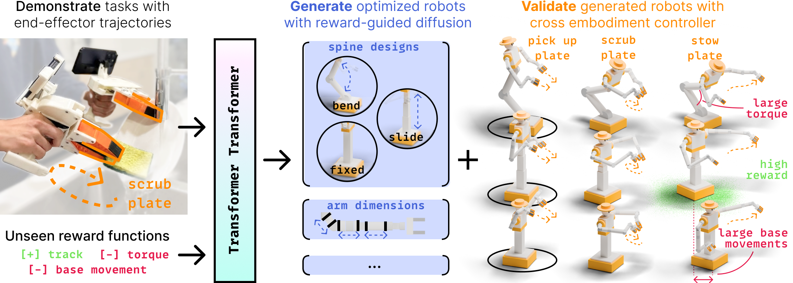
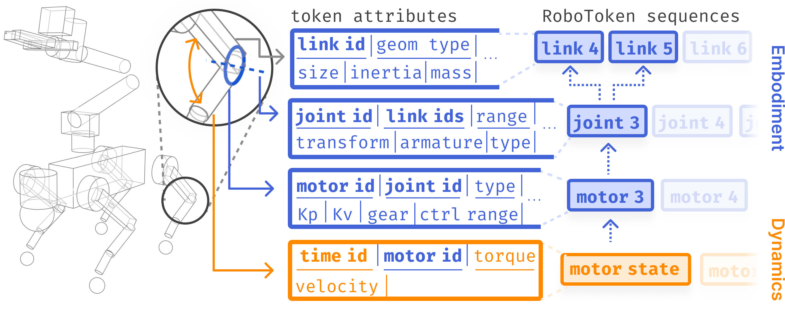
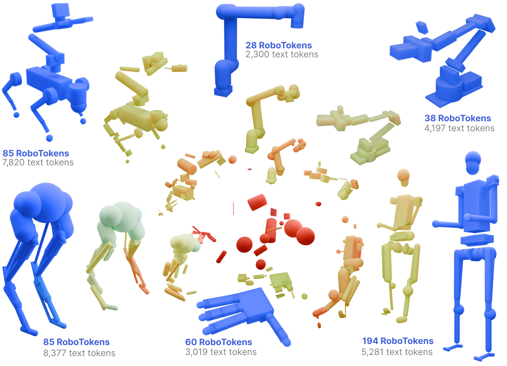
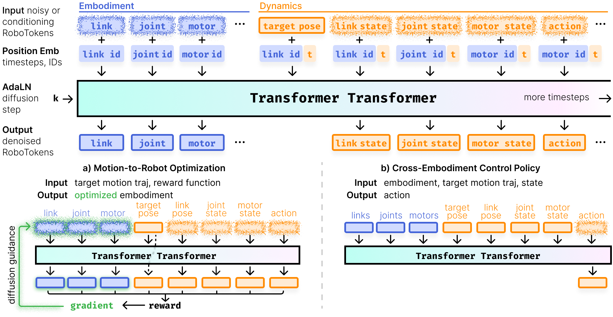
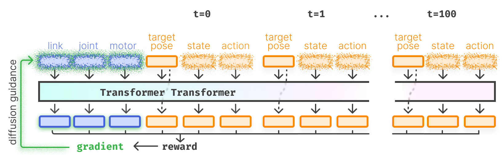
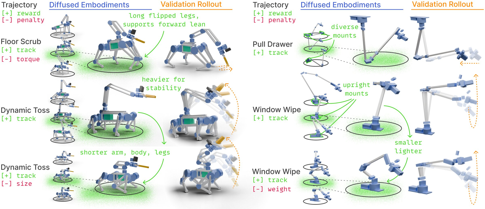
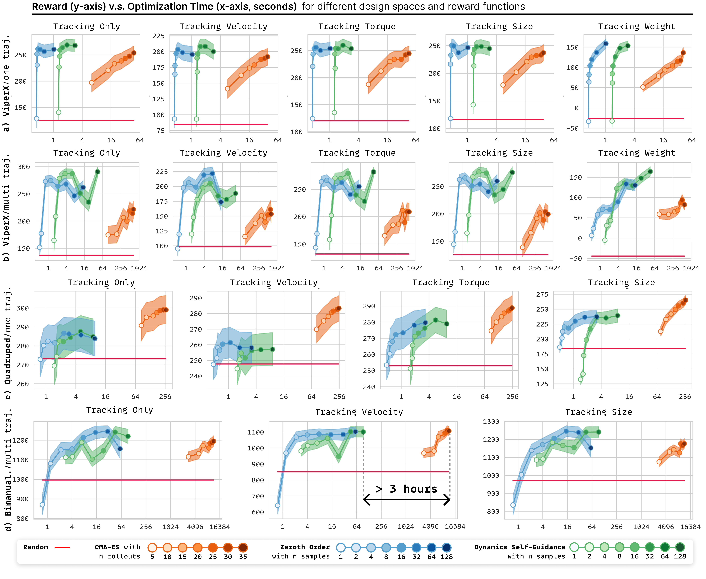
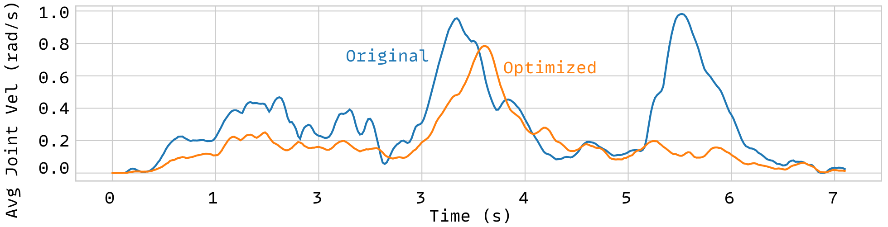

> 技术报告（中文翻译与整理）
> 原文项目主页：https://transformer-transformer.github.io/
> 论文：arXiv:2607.25798 ｜ 视频：https://youtu.be/TTyjvPVFbNw ｜ 代码：https://github.com/real-stanford/transformer-transformer
> 作者：Huy Ha、Karen Liu、Shuran Song（Stanford）

---

## 摘要：并非所有机器人生来平等

<video src="./assets/videos/real-world.mp4" controls loop muted playsinline width="100%"></video>

*视频：原始 ALOHA 与经 Transformer Transformer 优化后的 ALOHA 对比——同一任务、同一目标轨迹、两台机器人。优化后的设计能够展开布料，而原始设计做不到。*

并非所有机器人生来平等——但如果你能为某个特定任务专门设计一台机器人呢？我们提出 **Transformer Transformer**，一个恰好能做到这件事的统一模型：把一段操作演示交给它，它就能生成一台完整的机器人——包括每一根连杆、每一个关节、每一个电机以及惯性属性——并针对该运动进行优化。我们据此制造了一台用于布料抛掷（cloth flinging）的设计，部署在 ALOHA[2] 双臂平台上；相较原始设计，它把**跟踪误差降低了 73%**，最大关节速度降低了 30%。

支撑这一结果的，是一个在 **RoboTokens** 上训练的扩散 Transformer（diffusion transformer）。RoboTokens 是对机器人本体（embodiment）、状态（state）与动作（action）的统一 token 化表示。同一套架构可跨越多种本体空间（轮式双臂、四足、人形）与多种用途（本体生成、跨本体控制）。它并不是过拟合到某一个奖励函数，而是一个**动力学模型**：其与奖励无关的预测，在推理时被转换为与特定奖励相关的价值预测，进而用于引导本体扩散——我们把这一过程称为 **Dynamics Self-Guidance（动力学自引导）**。在三个设计空间上的实验表明，该模型可对未见过的奖励与轨迹进行零样本（zero-shot）优化，在性能与运行时间上都优于进化算法基线。

---

## 技术讲解视频

原文提供了一段 17 分钟的技术讲解视频，也可直接按图文（图+说明）版本往下滚动阅读。

- YouTube：https://youtu.be/TTyjvPVFbNw

---

## 动机：对于一个给定的操作任务，什么样的机器人才是最优的？

机器人的本体决定了它能把哪些任务做好。我们投入大量精力让机器人变得更"聪明"——更大的数据集、更好的算法、更强的策略架构——但一个糟糕的本体会拖累哪怕再优秀的策略。你可以收集全世界所有的抛掷数据，可如果机器人的形态离最优相去甚远，它可能会把自己抛出去，而不是把球抛出去。

于是我们把问题具体化。给定一段目标末端执行器（end-effector）运动和一个奖励函数作为输入，我们希望为该任务生成一台**完整的**机器人本体——所谓"完整"，是指每一根连杆、每一个关节、每一个电机、每一项惯性属性，外加一个驱动整体运转的控制器。我们称之为**运动条件机器人协同设计（motion-conditioned robot co-design）**。

<video src="./assets/videos/bad-hardware-raw.mp4" controls loop muted playsinline width="100%"></video>

*视频：一台随机程序化生成的机器人尝试执行目标运动：它还没完成动作就摔倒了 🙃*

---

## 框架：演示、生成、验证（Demonstrate, Generate, Validate）

我们的框架把机器人协同设计重新表述为三个步骤：你**演示（demonstrate）**期望的末端执行器运动（例如来自一段 UMI[3] 人类演示），我们的模型**生成（generate）**一台优化后的本体，同一个模型再通过直接控制该本体来**验证（validate）**这一设计。同一张网络扮演三种角色——生成器、评判器（critic）与跨本体控制器——靠的就是在**同一套机器人统一 token 化表示**上进行联合训练。

**三步，一个模型。** 给定目标末端执行器运动（例如来自人类演示）与用户定义的奖励，Transformer Transformer 先*生成*一台完整机器人——几何、运动学、惯性、电机——然后*控制*该机器人去跟踪运动。无需单独的优化器、评判器或控制器流水线。

> 本文分为三个部分：统一的**机器人表示**（RoboTokens）、统一的**架构**（Transformer Transformer）、以及统一的**训练目标**（Dynamics Self-Guidance）。你有直到架构章节的时间去想明白那个双关梗 🥸

---

## 第一部分：RoboTokens——统一的机器人表示

**每台机器人都变成一个带类型的 token 序列。** 蓝色 token 编码本体（连杆、关节、电机）；橙色 token 编码动力学（状态与动作）。同一个 token 化器可以摄入四足、人形或灵巧手——无需针对每台机器人做适配器——因此单个模型能在它们之间统一学习。

如果我们想用一个模型去协同设计*任意*机器人，网络就需要一套横跨所有本体的共享词表。RoboTokens 就是这套词表：为每一根连杆、每一个关节、每一个电机、每一个状态和每一个动作都设有带类型的 token——其组织方式使得单个序列既能描述机器人的*本体*（时间不变量），又能描述其*动力学*（时间变化量）。

RoboTokens 有以下关键设计目标：

- **完整（Complete）。** 一个 RoboToken 序列能刻画一台刚性铰接机器人的一切：5 种本体 token 类型（连杆、固定关节、旋转/滑动关节、球关节、电机）外加状态与动作 token。
- **灵活（Flexible）。** token 之间通过 ID 相互引用——一个关节 token 知道它连接的两个连杆 token——因此同一套格式既能处理 6 自由度机械臂，也能处理 35 自由度的双足机器人。
- **一致（Consistent）。** token 化器会对冗余的空间偏移做规范化处理，并把惯性/变换数据存放在单一坐标系中，从而降低模型需要学习消化的方差。
- **可扩展（Extensible）。** 新的 token 类型无需改动架构即可接入——我们为轨迹跟踪加入了目标末端执行器位姿 token，只需将其指向相关的末端执行器 ID 与时间步 ID，机器人其余部分无需重新 token 化。
- **可优化（Optimizable）。** 与 MJCF 之类的自回归文本格式不同，对连续值 RoboTokens 做扩散，既能获得*全局可控性*（在去噪步骤中，后面的 token 能影响前面的 token），又能获得*可微性*——这正是推理时基于梯度做奖励优化所需的两大要素。

我们对来自 MuJoCo Menagerie[10] 的 11 台机器人做了 token 化，其质量跨越两个数量级（从 0.65 kg 的灵巧手到 67.5 kg 的四足），主动关节数从 6 到 35 不等。每台机器人都变成一个 28–101 个 RoboToken 的序列——小到足以端到端地做扩散。

**RoboTokens 比 MJCF 文本紧凑 27–110 倍。** 一台机器人的完整描述可以装进几十个带类型的 token（蓝色计数），而语言 token 化器则需要数千个（灰色计数）——紧凑到 Transformer 可以直接对它们做扩散，而不必自回归地逐字书写 XML。

---

## 第二部分：Transformer Transformer——统一的架构

这个模型是一个在 RoboTokens 上训练、采用 DDIM[4] 噪声调度的扩散 Transformer（DiT[1]）。噪声会被加到每一个输入 token 上——*除了*我们用作条件的那些——通过改变*哪些* token 被遮蔽（mask），同一张网络就能戴上不同的"帽子"：

- 遮蔽全部 token，得到一个**无条件机器人生成器**。
- 遮蔽动作 token，得到一个**跨本体控制器**[5][6]。
- 遮蔽本体 token，得到一个**运动条件机器人设计器**。

同一套权重，在动力学上联合训练。

> （关于那个双关：第一个 "Transformer" 指的是本体可变的*机器人*（变形金刚）；第二个指的是自注意力*架构* 🥸）

**一套架构，两种用途。** (a) 运动到机器人的优化：联合扩散本体 token 与动力学 token。(b) 跨本体控制：以本体与目标运动为条件，扩散出动作。在推理时，模型自身的预测被转换为一个奖励预测，其梯度将生成过程引导向奖励更高的设计。

### 一个感知本体的控制器

因为控制器把完整本体作为输入，它能够根据自己正在驱动的机器人来调整控制策略。改变连杆惯性、关节范围或电机增益，同一个策略依然能保持跟踪——无需针对每台机器人重新训练。我们从 RL 专家[7][8][9]（在程序化四足空间上一设计一训练）中，行为克隆（behavior-clone）出了全身控制器。

<video src="./assets/videos/cross-embodiment-control.mp4" controls loop muted playsinline width="100%"></video>

**一个策略，多种四足。** 同一个控制器在具有连续变化（连杆尺寸）与离散变化（自由度、膝关节朝向、弹簧加载腿 vs. 串联腿）的四足机器人之间，跟踪同一条轨迹。

### 一个覆盖多样机器人类别的生成器

在完全无条件的情况下运行模型，它会从高斯噪声中扩散出完整的机器人。在 Menagerie[10] 的多样机器人上训练后，单个 Transformer Transformer 能生成固定基座机械臂、四足、人形和灵巧手。由于扩散是随机的，每次运行都会给出不同的机器人。

<video src="./assets/videos/looping_robotokens.mp4" controls loop muted playsinline width="100%"></video>

**机器人，被扩散出来。** 单个模型用同一套噪声调度，生成固定基座机械臂、四足、人形和灵巧手。

---

## 第三部分：Dynamics Self-Guidance——零样本对待奖励

现在轮到真正的协同设计问题：对于一个模型在训练时从未见过的奖励函数，我们如何生成一台高奖励的机器人？

诀窍如下。同一个模型同时预测本体*与*其动力学，因此我们可以把这些预测喂给用户的奖励函数，得到一个*预测奖励*。有了预测奖励，我们就能并行地运行模型许多次，为每个候选预测奖励，并返回最好的那个。这就是 best-of-N 采样，但以 GPU 速度进行。

我们还能做得更好。由于预测奖励是本体 token 的可微函数，我们可以取它的梯度并注回扩散过程——在每一个去噪步骤都把样本推向更高奖励，遵循分类器引导的 DDIM[11]。这个模型实际上是在自问："这台机器人该如何改变才能增大奖励？"我们称之为 **Dynamics Self-Guidance（动力学自引导）**。

> **为何叫"自引导"：** 将动力学纳入扩散引导的相关工作，要么训练一个独立的动力学模型[12]，要么依赖可微分仿真器[13]。而这里，模型用*它自己*的动力学预测来引导自身。

**一次梯度，覆盖整段回合。** Transformer Transformer 并行地预测整段回合时域内的状态与动作 token；奖励梯度随后穿过全部内容回流到本体 token。硬件是在长时域动力学上被优化的，而不是逐时间步优化。

### 奖励进，机器人出

拿一台随机生成、在动态抛掷中会摔倒的四足机器人为例。让我们的模型仅用一个跟踪奖励为同一条轨迹生成机器人，它会降低质心并加宽支撑多边形——这些稳定的设计选择，是它在试图最大化一个从未见过的跟踪奖励时作为副产物发现的。

现在加入一个力矩惩罚项，优化的地形（landscape）随之改变。模型返回一台更小、更轻的机器人——仍能跟踪运动，但平均力矩少用了 30%。再加入一个尺寸惩罚，地形再次改变。这就是人们可能称之为*零样本对待奖励*的东西：在动力学建模上训练，在推理时针对任何你能写下来的奖励做优化。

**同一模型，不同条件，不同机器人。** 更换目标轨迹（Floor Scrub 地面擦洗 → Dynamic Toss 动态抛掷）或加入尺寸惩罚，会重塑优化地形，生成的本体也随之改变——无需重新训练。离散选择（腿部设计、自由度）与连续选择（连杆长度、安装点）都会相应变化。

### 组合扩散模型以适配整个数据集

操作任务不是单一运动，而是运动的一个*分布*。我们想为一整个任务优化一台机器人——比如洗碗——而不是单条轨迹。扩散组合（diffusion composition）[14][15] 恰好让我们能做到这一点：以不同轨迹作为条件并行运行模型，在每个扩散步骤对预测噪声取平均，你就得到一个同时对所有这些轨迹优化过的生成器。

我们在公开的 UMI 双臂洗碗数据集[3] 上测试了这一点，留出 26 条验证轨迹。Transformer Transformer 生成了在整个留出分布上优化过的机器人——同时在离散空间（脊柱设计：固定、滑动、可弯曲）与连续空间（臂部尺寸、安装偏移）中导航——同一模型随后又充当跨本体控制器，去验证每个生成的设计。

<video src="./assets/videos/multi-traj.mp4" controls loop muted playsinline width="100%"></video>

**一台机器人，一整个任务。** 在 26 条留出的 UMI 洗碗轨迹上做组合后，模型返回一台针对整个分布优化的本体——同一张网络随后驱动它完成每一段运动。

---

## 结果：更好的设计，更快得到

我们与两个基线比较：**Random**（从程序化设计空间中采样一台机器人）与 **CMA-ES**[16]（一种在协同设计中被广泛使用的黑箱优化器）。CMA-ES 在 MuJoCo[17] 中用设计空间的控制器（固定基座/双臂用 Mink[18]；腿式机器人用 RL 专家[7]）对候选机器人做 rollout，然后把下一代偏向奖励更高的样本。

我们给所有方法相同的任务：为一条目标轨迹与奖励生成一台机器人，控制它，报告所达成的奖励。

### 测试时计算可以扩展结果

就像大语言模型在"思考"更久时表现更好[19] 一样，当给 Transformer Transformer 更多推理种子去采样时，它能得到更好的设计。不过性能大约在一分钟后最终会趋于平台期——不像 LLM 从更长推理中获得的那种看似无止境的增益。我们在局限性中讨论了这一点。

**更高的奖励，快上几个数量级。** 在三个设计空间与多个奖励函数上，我们的 Zeroth Order（零阶）与 Dynamics Self-Guidance 两个变体，都随着允许更多并行样本而产出更高奖励的设计——并且都在数秒（而非数小时）内达到了 CMA-ES 级别的质量。对于多轨迹双臂优化（最右），CMA-ES 用了 3 小时以上；我们的模型在一分钟内完成。

> **为什么这么快？** 两个原因相乘。(1) 在候选设计上做 GPU 并行化。(2) 非自回归扩散并行地评估整段 rollout，而不是逐时间步。典型的学习式动力学模型一次预测一步；我们一次预测整段回合。

---

## 真实世界：ALOHA 上的布料抛掷

<video src="./assets/videos/real-world.mp4" controls loop muted playsinline width="100%"></video>

**原始 ALOHA vs. 经 Transformer Transformer 优化的 ALOHA。** 同一任务、同一目标轨迹、两台机器人。优化后的设计能把布料展开，而原始设计做不到。

为了在硬件上对整个系统做压力测试，我们选择了 ALOHA[2] 上的动态布料展开任务。抛掷（Flinging）[20] 会同时通过运动学（手臂必须高速伸过布料上方）与未建模动力学（空气阻力、布料重量、摩擦）来惩罚本体上的错误。原始 ALOHA 设计连跟踪该轨迹都很吃力。

我们让模型针对 "Tracking Velocity（跟踪速度）" 奖励优化 ALOHA 设计，然后制造出得到的设计。相较原始设计，有两处改变：

- **更长的连杆长度。** 恰好足以在运动学上伸过抛掷轨迹，同时又足够轻，能保持在 Dynamixel 电机的力矩包络之内。
- **倒置安装。** 手臂在工作空间后方倒挂，使得可以用一种节能的下摆挥动（underarm swing）代替过顶抛掷（overhead fling）。

**更平滑的关节轨迹。** 抛掷运动过程中的关节速度。优化后的设计峰值更少、最大值更低——运动学与动力学上的收益迁移到了硬件上。

---

## 局限性与未来工作

- **几何与场景。** RoboTokens 目前只覆盖基于图元（primitive）的几何，尚不支持任意网格或可变形体，也还未编码周围场景或接触目标。扩展到复杂几何与场景上下文，是迈向完全任务条件协同设计的明确下一步。
- **控制器迁移。** 我们的跨本体控制器在扩散得到的本体上与 RL 预言机（oracle）的皮尔逊相关系数 *r* = 0.53——有希望但仍有提升空间。一些离群本体暴露了控制器泛化失败之处。
- **测试时扩展平台期。** 与其他引导式扩散方法一样，我们的测试时计算收益在约一分钟后趋于平台。不像 LLM[19]，超过某个点后更多推理时间就不再有帮助。提升奖励预测精度与探索替代推理方案是开放方向。
- **数据生成成本。** 基于 RL 的全身控制器数据生成代价高昂（每个离散设计选择需一个 RL 专家，每个策略耗费 16 小时 A100）。把 Transformer Transformer 扩展到新的设计空间，取决于能否降低这一成本。

---

## 参考文献

1. Peebles, W., & Xie, S. *Scalable diffusion models with transformers.* ICCV, 2023.
2. Zhao, T. Z., Kumar, V., Levine, S., & Finn, C. *Learning fine-grained bimanual manipulation with low-cost hardware.* arXiv:2304.13705, 2023.
3. Chi, C., Xu, Z., Pan, C., Cousineau, E., Burchfiel, B., Feng, S., Tedrake, R., & Song, S. *Universal Manipulation Interface: In-The-Wild Robot Teaching Without In-The-Wild Robots.* RSS, 2024.
4. Song, J., Meng, C., & Ermon, S. *Denoising Diffusion Implicit Models.* ICLR, 2021.
5. Furuta, H., Iwasawa, Y., Matsuo, Y., & Gu, S. S. *A system for morphology-task generalization via unified representation and behavior distillation.* arXiv:2211.14296, 2022.
6. Gupta, A., Fan, L., Ganguli, S., & Fei-Fei, L. *MetaMorph: Learning universal controllers with transformers.* arXiv:2203.11931, 2022.
7. Ha, H., Gao, Y., Fu, Z., Tan, J., & Song, S. *UMI on Legs: Making Manipulation Policies Mobile with Manipulation-Centric Whole-body Controllers.* CoRL, 2024.
8. Schulman, J., Wolski, F., Dhariwal, P., Radford, A., & Klimov, O. *Proximal policy optimization algorithms.* arXiv:1707.06347, 2017.
9. Rudin, N., Hoeller, D., Reist, P., & Hutter, M. *Learning to walk in minutes using massively parallel deep reinforcement learning.* CoRL, 2022.
10. Zakka, K., Tassa, Y., & MuJoCo Menagerie Contributors. *MuJoCo Menagerie: A collection of high-quality simulation models for MuJoCo.* 2022. github.com/google-deepmind/mujoco_menagerie
11. Dhariwal, P., & Nichol, A. *Diffusion models beat GANs on image synthesis.* NeurIPS, 2021.
12. Xu, X., Ha, H., & Song, S. *Dynamics-Guided Diffusion Model for Sensor-less Robot Manipulator Design.* arXiv:2402.15038, 2024.
13. Wang, T.-H. J., Zheng, J., Ma, P., Du, Y., Kim, B., Spielberg, A., Tenenbaum, J., Gan, C., & Rus, D. *DiffuseBot: Breeding soft robots with physics-augmented generative diffusion models.* NeurIPS, 2023.
14. Liu, N., Li, S., Du, Y., Torralba, A., & Tenenbaum, J. B. *Compositional visual generation with composable diffusion models.* ECCV, 2022.
15. Du, Y., Durkan, C., Strudel, R., Tenenbaum, J. B., Dieleman, S., Fergus, R., Sohl-Dickstein, J., Doucet, A., & Grathwohl, W. S. *Reduce, reuse, recycle: Compositional generation with energy-based diffusion models and MCMC.* ICML, 2023.
16. Hansen, N., & Ostermeier, A. *Completely derandomized self-adaptation in evolution strategies.* Evolutionary Computation 9(2): 159–195, 2001.
17. Todorov, E., Erez, T., & Tassa, Y. *MuJoCo: A physics engine for model-based control.* IROS, 2012.
18. Zakka, K. *Mink: Python inverse kinematics based on MuJoCo.* 2025. github.com/kevinzakka/mink
19. Brown, B., Juravsky, J., Ehrlich, R., Clark, R., Le, Q. V., Ré, C., & Mirhoseini, A. *Large language monkeys: Scaling inference compute with repeated sampling.* arXiv:2407.21787, 2024.
20. Ha, H., & Song, S. *FlingBot: The unreasonable effectiveness of dynamic manipulation for cloth unfolding.* CoRL, 2021.

> 完整参考文献见论文。以上仅覆盖本页所引用的文献。

---

*本报告为 https://transformer-transformer.github.io/ 项目主页内容的忠实中文翻译与整理。图片与视频素材下载自原站，存放于 `assets/` 目录。网站模板改编自 NeRFies。*
